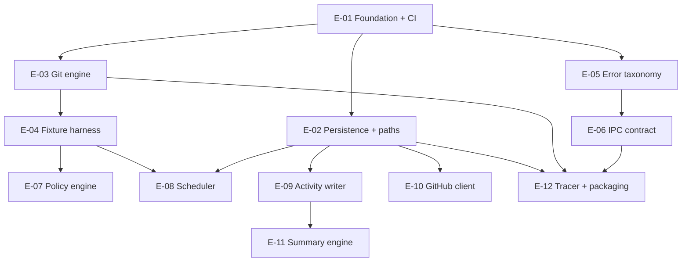

# RepoSync V1 - Execution Plan (non-GUI functional efforts)

This is the program-level plan for everything in RepoSync V1 that can be built, tested, and frozen **without a single final UI/UX decision**. It decomposes the backend, data, contract, and integration work into numbered efforts, each of which carries its own `spec.md` (the contract) and `plan.md` (the implementation steps) in its folder.

It operationalizes `docs/internal/v1-architecture-and-decisions.md` (the architecture and decisions brief). Read that brief for the full rationale; read this for the work breakdown.

## Ratified decisions this plan assumes

| Decision | Ratified direction | Date |
|---|---|---|
| Platform | True dual-platform, **Windows-first**, maximally common architecture; macOS degrades to "compiles + bundles in CI" until real Mac access | 2026-05-31 |
| Autonomy boundary | **Visibility-tiered merge** (agent self-merges green PRs while private; human-reviewed once public) layered on a 7-item human-only allowlist (both adopted: the allowlist sits on top of the tiered merges). See `EXECUTION.md` | 2026-06-19 |
| V1 scope line | **MUST / SHOULD / CUT** tiering ratified (below), with pre-committed descope triggers | 2026-06-19 |
| Gitignore (repo hygiene) | `docs/internal/` is **TRACKED**; `_LOCAL/` is gitignored. This **OVERRIDES** the brief Section 6 repo-hygiene wording about quarantining `docs/internal/`. | 2026-06-19 |
| Command naming | Normalized to singular `repo_list` (the brief mixed `repos_list` with the `repo_*` family). All command names use the singular `repo_*` form. | 2026-06-19 |
| Schema additions | `repo_local_state` gains `consecutive_failures` and `auto_paused` columns (for the 3-strikes auto-pause); `repo_remote_meta` gains `etag`. All land in the **initial migration**. | 2026-06-19 |

## Scope ledger

| Tier | Items | In these efforts |
|---|---|---|
| **MUST** | Add/scan repos, list + detail, manual + scheduled fetch (ff-only), activity log, error states, enable/disable, settings | E-02, E-03, E-04, E-05, E-06, E-07, E-08, E-09, E-12 |
| **SHOULD (keep)** | Unauthenticated GitHub enrichment + ETag caching, daily summary | E-10 (unauthenticated path), E-11 (daily only) |
| **CUT to V1.1** | Tray popup window (keep native menu), keyring PAT, weekly summary, grouping/tags, saved filters, recipes, auto-updater | Stubbed behind seams: PAT path in E-10, weekly aggregation in E-11; the rest are UI-surface and out of these efforts entirely |

## The seam principle (why this is all buildable now)

The entire backend lives on one side of a single seam: the **typed IPC contract** (E-06). UI/UX decisions govern *rendering*, never *what data exists or how git, the DB, and the scheduler behave*. Freeze the contract early and both halves proceed independently and indefinitely. Every effort below depends on the frozen contract at most, never on a finished screen. `reposync-core` never imports `tauri`; that is what keeps all of this headlessly unit-testable and makes the macOS port a thin edge.

## Effort index

| Effort | Title | Delivers | Depends on | Brief section |
|---|---|---|---|---|
| **E-01** | Foundation, workspace, CI | Cargo workspace, `reposync-core` + `src-tauri` skeletons, repo hygiene, CI matrix + dependency-hygiene gate | - | 4.3, 6 |
| **E-02** | Persistence & paths | SQLite schema as numbered migrations (incl. `scoped_bookmark_blob`), `sqlx::migrate!` runner, WAL pool, `paths` seam, migration-failure recovery | E-01 | 4.5, 4.10b/c |
| **E-03** | Git engine | `cli.rs` (network/mutation) + `inspect.rs` (git2 reads) behind `GitEngine` trait; git discovery + 2.30 floor; git-not-found state | E-01 | 4.6, 4.10d |
| **E-04** | Git fixture harness | Programmatic bare + working repo pairs for all 7 states; pinned git in CI; git2-vs-CLI cross-check | E-03 | 6 |
| **E-05** | Error taxonomy | `AppError` (~30 `thiserror` codes + remediation), `serde` + `specta::Type` | E-01 | 6, 4.10 |
| **E-06** | IPC contract | Command + event surface as Rust types in `reposync-core::ipc`; `tauri-specta` TS codegen; version pin + fallback | E-05 | 4.4 |
| **E-07** | Update-policy engine | Pure `(repo state, policy) -> action or skip-with-reason`; modes, dirty/branch/failure handling, 3-strikes auto-pause | E-04 | 4.6, 5 |
| **E-08** | Scheduler | `tokio` interval, `next_check_at`, jitter, bounded semaphore, quiet hours, **per-repo async mutex**, injected clock | E-04, E-02 | 4.7 |
| **E-09** | Activity log writer + retention | Append every git op with full context; retention sweep honoring `activity_retention_d` (default 90) | E-02 | 4.5, 6 |
| **E-10** | GitHub metadata client | `octocrab`/`reqwest-rustls`, ETag conditional requests, rate-limit backoff; **unauthenticated** V1 path, PAT path stubbed behind a seam for V1.1 | E-02 | 4.4, 6 |
| **E-11** | Summary engine | Daily summary aggregation; weekly left as a V1.1 extension point | E-09 | Section 3 (SHOULD tier) + descope trigger |
| **E-12** | Tracer bullet + packaging spike | `repo_add_path` + `repo_check_now` end to end (real git to SQLite to emitted event) on a real Windows build behind a throwaway UI; early Windows MSI from CI | E-02, E-03, E-06 (thin-slice-sufficient on E-06: needs only the `repo_add_path` / `repo_check_now` / `repo:check-completed` contract slice, not full E-06) | 6 |

> **Note on E-11 (summary engine):** the brief has no Section 6 summary workstream. E-11 is a plan-level expansion of the SHOULD-tier "daily summary" scope item (brief Section 3), and is governed by its own pre-committed descope trigger (cut to V1.1 if not green by end of week 5).

> **Dependency-edge semantics:** an edge is either *thin-slice-sufficient* (the downstream effort needs only a named contract or interface slice of its upstream, not the upstream's full completion) or *full-completion-required* (the downstream effort cannot start until the upstream is finished and frozen). E-12's edge to E-06 is thin-slice-sufficient (the `repo_add_path` / `repo_check_now` / `repo:check-completed` slice only), and week-1 uses only *minimal* slices of E-02 (schema + runner) and E-03 (one git2 read + CLI fetch); the remaining edges in the graph below are full-completion-required.

## Dependency graph

## Sequencing (UI-independent, ~3 weeks then breadth)

The tracer bullet (E-12) is deliberately pulled forward into week 1, built on *thin-slice-sufficient* slices of E-01/E-02/E-03/E-06 (see the edge-semantics note above), so the whole architecture is pierced once before any breadth is built. E-12 needs only the `repo_add_path` / `repo_check_now` / `repo:check-completed` contract slice of E-06, not full E-06, and only *minimal* slices of E-02 and E-03; it does not wait on those efforts completing. The riskiest cross-platform unknowns surface while the codebase is tiny.

- **Week 1 - prove the spine, lay the floor.** E-01 (workspace + hygiene + CI), minimal E-02 (schema + runner) and minimal E-03 (one git2 read + CLI fetch), then the E-12 tracer end to end on a real Windows build with the macOS bundle green in CI.
- **Week 2 - make the engine trustworthy and freeze the seam.** E-04 (fixture harness, the biggest testability multiplier), E-03 parsers + git2/CLI cross-check hardened, E-05 (`AppError`), E-06 (full IPC contract + `tauri-specta` codegen). After week 2 the seam is frozen and the frontend can stub against real types.
- **Week 3 - layer logic, background machinery, packaging.** E-07 (policy), E-08 (scheduler), E-09 (activity writer), E-10 (GitHub client), E-11 (daily summary), and a real packaging spike producing a signed-or-documented Windows artifact.

## Descope triggers (pre-committed)

- If the tray popup window (a V1.1 item already) is ever pulled into V1 and is not stable on Windows by end of week 4, it stays cut and V1 ships with the native menu only.
- If macOS signing/notarization is not unblocked (Mac access + credentials) by end of week 4, drop macOS from the V1 GA bar and ship Windows-only GA, macOS as a staged later GA. Watch this first; it is the most likely buffer-eater.
- If GitHub enrichment (E-10) is not green by end of week 5, ship V1 with local git state only and add enrichment in a fast-follow.
- If the daily summary (E-11) is not done by end of week 5, cut it to V1.1 (it is SHOULD, not MUST).

## Conventions and structure

- Each effort lives in `AGENTS/efforts/E-NN-slug/` with `spec.md` and `plan.md`.
- `spec.md` is the contract: frontmatter, a Task Summary block agents keep current, scope, the interface/contract, acceptance criteria with source citations into the brief, dependencies, and V1.1 extension points.
- `plan.md` is the how: ordered steps, test strategy, files touched, risks, and a definition of done.
- Hard rules: no em-dashes or en-dashes anywhere; `reposync-core` never imports `tauri`; tests are written with the logic (test-first for the pure engines E-07/E-08).

## Source

`docs/internal/v1-architecture-and-decisions.md` (architecture + decisions brief) and `docs/internal/strategy-and-roadmap.md` (the original plan it extends). Governance: `EXECUTION.md` at the repo root.
