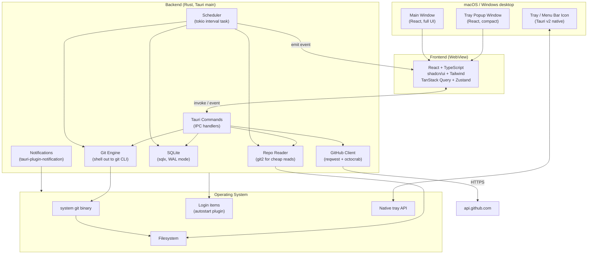

# RepoSync, Strategy and Roadmap

> Working title: **RepoSync**. Final brand and `.com` are unresolved (see Section 10).

## 0. TL;DR

RepoSync is a cross-platform desktop app (macOS + Windows) that helps a single user keep a personal library of cloned-but-not-actively-developed Git repositories fresh, visible, and easy to launch. It runs as a resident tray / menu-bar utility with a richer main window for management and review. The MVP focuses on safe read-mostly operations (`fetch`, `pull --ff-only`) on a schedule, with explicit per-repo policy and an audit trail.

The app is built on **Tauri v2 + Rust** for the backend, **React + TypeScript + shadcn/ui** for the frontend, and **SQLite** for persistence. Git operations shell out to the system `git` binary in v1 to inherit the user's existing credential helpers; `git2` (libgit2 bindings) is reserved for cheap read-only inspection where it adds value.

The roadmap is organized into four phases:

1. **Phase 0, Foundations.** Project scaffold, capability config, DB layer, tray window, basic IPC. ~2 weeks.
2. **Phase 1, V1 MVP.** Add/scan repos, list/detail UI, manual fetch, scheduled fetch, ff-only pull, activity log, daily summary, packaging. ~6 weeks.
3. **Phase 2, V1.1 Polish.** Release tracking, weekly summary, grouping/tags, search/sort/saved filters, custom command recipes. ~4 weeks.
4. **Phase 3, V2+.** Smart change summaries, advanced rebase workflows, OS-native scheduling, multi-host support beyond GitHub.

---

## 1. Product Framing

### 1.1 Vision

Make it trivial to keep a personal collection of consumer-mode local repos current and visible, without forcing the user to think about Git plumbing or pay attention to N separate folders.

### 1.2 Target user

A developer who has 5 to 100+ cloned repositories on disk that they primarily *consume* rather than contribute to. Examples:

- Self-hosted apps (e.g., open-source tools the user runs locally).
- Reference repos read for documentation, code samples, or design inspiration.
- Template / starter repos.
- Forks rarely modified.
- Projects the user runs locally with `npm start` but does not develop on.

The user is technically competent, comfortable with Git on the command line, but does not want to babysit `git fetch` across dozens of folders.

### 1.3 Primary jobs to be done

1. **Keep selected local repositories fresh and visible.** "I want to know what is current and what is not, at a glance."
2. **Make it easy to understand what changed.** "When something updates, I want a readable changelog, not just commit hashes."
3. **Provide safe, configurable update automation.** "Default to read-mostly; let me opt in to mutation per repo."
4. **Reduce terminal friction for repo awareness.** "Open in editor, open in browser, open in terminal, run a command, all from one place."

### 1.4 Anti-positioning, what RepoSync is not

- Not a Git client for active development. Not competing with GitKraken, Tower, SourceTree, or the GitHub Desktop core workflows.
- Not a CI / deployment tool.
- Not an IDE workspace manager (does not replace VS Code multi-root).
- Not a process manager (does not replace PM2). v1 may launch user-defined commands, but operational lifecycle is out of scope.
- Not multi-user / team-shared in v1.

This sharp anti-positioning matters because it lets us choose conservative defaults (e.g., "fetch only" by default) without apologizing.

---

## 2. Strategic Principles

These principles are load-bearing and should be the tiebreaker on design decisions:

1. **Default to safe behavior over clever behavior.** Fetch by default. Mutation requires explicit per-repo opt-in.
2. **Make repo state obvious at a glance.** A user should be able to look at the list view and instantly see: clean/dirty, ahead/behind, last fetch, last update, error state.
3. **Preserve user trust with transparent logs and predictable actions.** Every Git invocation is recorded with command, exit code, stdout/stderr, timestamp.
4. **Treat consumer repos differently from active contribution repos.** This is the core product wedge.
5. **Never hide risky Git behavior behind vague UI language.** "Pull with rebase" must look risky in the UI when it is.
6. **Make manual control easy when automation is inappropriate.** Every automated action must have a manual equivalent and an opt-out.
7. **Local-first.** No cloud account required for v1. The user's data and repo list stay on their machine.

---

## 3. Approach: Tauri v2 + Rust + React + TypeScript + shadcn/ui

### 3.1 Why this stack (anchor decision)

The stack is fixed, but documenting why grounds future decisions:

- **Tauri v2** ships a small native shell that uses the OS webview (WebView2 on Windows, WKWebView on macOS) instead of bundling Chromium. Result: significantly smaller installer and lower idle memory than Electron, which matters for a tray app that runs all day.
- **Rust** is the right backend language for a tool that orchestrates filesystem traversal, subprocess execution, SQLite I/O, and timed background work. The type system catches whole categories of concurrency bugs that would otherwise show up as flaky scheduled-update failures.
- **React + TypeScript** is the most agent-friendly UI ecosystem (ample training data, strong tooling), and Tauri integrates cleanly via Vite.
- **shadcn/ui** is unusually well-suited to agentic development because the components are copied into the project as source code, not consumed as a black-box library. Agents can edit them directly. Built on Radix Primitives for accessibility.
- **SQLite** via `sqlx` or `rusqlite` is the obvious local persistence choice: zero-config, transactional, single-file, plays well with backup/export.

### 3.2 High-level architecture



### 3.3 Process and threading model

- **Single Tauri main process** owns the Tokio runtime.
- **One scheduler task** (interval-driven) fans out per-repo work through a bounded `Semaphore` (default: 4 concurrent Git ops). Prevents thrashing on disk and on the GitHub API.
- **Per-repo tasks** are non-blocking and emit progress events to the frontend.
- **Database access** through a single `SqlitePool` (sqlx) in WAL mode. Reads and writes coordinate through the pool; the scheduler holds short transactions and never holds a lock across a network call.
- **Frontend** reads via Tauri commands and subscribes to events for live updates. No polling on the JS side.

### 3.4 Rust backend responsibilities

The Rust side owns:

1. The **repo registry** (CRUD against SQLite).
2. **Discovery / scanning** (recursive walk to find `.git` folders).
3. **Git execution** (shelling out, capturing output, parsing structured data).
4. **Lightweight Git inspection** via `git2` for things like HEAD SHA, branch list, ahead/behind counts, dirty status.
5. **Scheduling and policy enforcement** (when to run, what mode, dirty-skip rules).
6. **Activity logging** (every Git invocation persisted with full context).
7. **Summarization** (computing daily / weekly rollups).
8. **GitHub API integration** for description, default branch, releases, topics.
9. **Notifications** via `tauri-plugin-notification`.
10. **Tray menu and popup window lifecycle**.

### 3.5 Crate selection

| Concern | Crate | Notes |
|---|---|---|
| Async runtime | `tokio` | Already required by Tauri. |
| HTTP client | `reqwest` (rustls) | For GitHub API calls. Avoid OpenSSL on Windows. |
| GitHub API | `octocrab` | Higher-level wrapper around `reqwest`; good for releases and repo metadata. |
| SQLite | `sqlx` (with `runtime-tokio-rustls`, `sqlite` feature) | Compile-time checked queries, async, pooled. Alternative: `rusqlite` if the macro overhead is unwanted. |
| Migrations | `sqlx::migrate!` | Embed `.sql` files at compile time. |
| Git CLI execution | `tokio::process::Command` | Spawn `git`, capture stdout/stderr, parse exit status. |
| Git library reads | `git2` | libgit2 bindings. Use for cheap status/HEAD/branch reads, not network. |
| Filesystem walking | `ignore` or `walkdir` | `ignore` respects `.gitignore` and is fast; `walkdir` is simpler. Probably `walkdir` is enough for `.git` discovery. |
| Filesystem watching | `notify` (optional, post-MVP) | If we want to react to local changes. |
| Time / scheduling | `chrono` | Plus `tokio::time::interval` for the timer loop. |
| Logging | `tracing` + `tracing-subscriber` | Structured logs, with `tracing-appender` for file rotation. |
| Errors | `thiserror` (lib types) + `anyhow` (top level) | Standard pattern. |
| Serialization | `serde` + `serde_json` | For Tauri command payloads and DB blob fields. |
| Config | `tauri-plugin-store` (lightweight prefs) + DB (structured data) | Avoid two stores; reserve `store` for app-level prefs only. |

### 3.6 Tauri v2 plugins

| Plugin | Purpose | Phase |
|---|---|---|
| `tauri-plugin-autostart` | Launch at login on macOS and Windows. | Phase 1 |
| `tauri-plugin-notification` | OS-native notifications for new releases, failures. | Phase 1 |
| `tauri-plugin-dialog` | Folder picker for "add repo" / "scan parent". | Phase 1 |
| `tauri-plugin-fs` | Capability-scoped filesystem access. | Phase 1 |
| `tauri-plugin-shell` | Open external URLs and apps (editor, terminal). Allowlist required. | Phase 1 |
| `tauri-plugin-os` | Platform detection for branching tray asset rendering. | Phase 1 |
| `tauri-plugin-process` | Spawn `git` (alternative to `tokio::process::Command`; evaluate). | Phase 1 |
| `tauri-plugin-single-instance` | Second launch focuses existing instance instead of spawning. | Phase 1 |
| `tauri-plugin-window-state` | Restore main window size / position. | Phase 1 |
| `tauri-plugin-log` | Pipe Rust `tracing` output to a rolling log file. | Phase 1 |
| `tauri-plugin-updater` | App self-update. | Phase 2 |
| `tauri-plugin-clipboard-manager` | Copy local path / remote URL actions. | Phase 1 |

### 3.7 Frontend responsibilities

The React app owns:

1. **Rendering** the repo list, detail panel, dashboard, settings, activity, summaries.
2. **Calling Tauri commands** for all data (no business logic in JS).
3. **Subscribing to backend events** for live updates (scheduler tick, repo state change, error).
4. **Local UI state** (filters, sort, drawer open, modal visible).
5. **Form validation** at the input layer; backend revalidates on commit.

### 3.8 React ecosystem libraries

| Concern | Library | Notes |
|---|---|---|
| Framework | React 18 + TypeScript | Strict mode on. |
| Build / dev | Vite | Tauri default, fast HMR. |
| Components | shadcn/ui | Source-copied components, owned in repo. |
| Primitives | Radix UI | Comes with shadcn. |
| Styling | Tailwind CSS v4 | shadcn default. |
| Icons | Lucide React | shadcn default. |
| Server state | TanStack Query (`@tanstack/react-query`) | Caches Tauri command results, retries, background refetch. |
| Client state | Zustand | Tiny, no Provider tree, ergonomic with Tauri events. |
| Routing | React Router v6 | For main window pages: Dashboard, Repos, Activity, Summaries, Settings. |
| Tables | TanStack Table | For the repo list view (sort, filter, virtualization later). |
| Virtualization | TanStack Virtual | If repo count grows past ~200. |
| Dates | `date-fns` | Relative timestamps, formatting. |
| Toasts | Sonner | shadcn default. |
| Forms | React Hook Form + Zod | Per-repo policy editing, settings forms. |
| Charts (later) | Recharts or Visx | Activity charts in summaries. Optional. |

### 3.9 IPC contract: Tauri commands and events

The IPC boundary is the API. Treat it like any other API: stable, typed, versioned.

**Sample commands (Phase 1):**

```rust
// Repo registry
#[tauri::command] async fn repo_list(filter: RepoFilter) -> Result<Vec<RepoSummary>, AppError>;
#[tauri::command] async fn repo_get(id: RepoId) -> Result<RepoDetail, AppError>;
#[tauri::command] async fn repo_add_path(path: PathBuf) -> Result<RepoId, AppError>;
#[tauri::command] async fn repo_scan_parent(path: PathBuf) -> Result<ScanResult, AppError>;
#[tauri::command] async fn repo_remove(id: RepoId) -> Result<(), AppError>;
#[tauri::command] async fn repo_set_enabled(id: RepoId, enabled: bool) -> Result<(), AppError>;
#[tauri::command] async fn repo_set_policy(id: RepoId, policy: UpdatePolicy) -> Result<(), AppError>;

// Git operations
#[tauri::command] async fn repo_check_now(id: RepoId) -> Result<CheckResult, AppError>;
#[tauri::command] async fn repo_update_now(id: RepoId, mode: UpdateMode) -> Result<UpdateResult, AppError>;
#[tauri::command] async fn repo_refresh_metadata(id: RepoId) -> Result<RepoDetail, AppError>;

// Quick actions
#[tauri::command] async fn repo_open_folder(id: RepoId) -> Result<(), AppError>;
#[tauri::command] async fn repo_open_terminal(id: RepoId) -> Result<(), AppError>;
#[tauri::command] async fn repo_open_editor(id: RepoId) -> Result<(), AppError>;
#[tauri::command] async fn repo_open_remote(id: RepoId) -> Result<(), AppError>;

// Activity / summaries
#[tauri::command] async fn activity_list(filter: ActivityFilter) -> Result<Vec<ActivityRecord>, AppError>;
#[tauri::command] async fn summary_today() -> Result<DailySummary, AppError>;
#[tauri::command] async fn summary_week() -> Result<WeeklySummary, AppError>;

// Settings
#[tauri::command] async fn settings_get() -> Result<Settings, AppError>;
#[tauri::command] async fn settings_set(settings: Settings) -> Result<(), AppError>;
```

**Events emitted by backend:**

| Event | Payload | Trigger |
|---|---|---|
| `repo:state-changed` | `{ id, state }` | After any state mutation. |
| `repo:check-started` | `{ id }` | Scheduler or manual check begins. |
| `repo:check-completed` | `{ id, result }` | Check finishes. |
| `repo:update-started` | `{ id, mode }` | Update begins. |
| `repo:update-completed` | `{ id, result }` | Update finishes. |
| `scheduler:tick` | `{ ran, skipped, failed }` | After each scheduler cycle. |
| `notification:fired` | `{ kind, body }` | When a notification is shown. |
| `error:raised` | `{ scope, message }` | Recoverable runtime error. |

The frontend uses TanStack Query to cache commands, and listens for the corresponding events to invalidate caches. This keeps UI in sync without polling.

### 3.10 Background scheduling model

- One `tokio::time::interval` ticks every minute.
- On each tick, query DB for repos whose `next_check_at <= now()` and whose `enabled = true`.
- For each due repo, push a job onto a bounded channel; worker pool drains the channel respecting the semaphore.
- After a job completes, update `last_checked_at`, `last_updated_at`, write an activity record, recalc `next_check_at`, and emit events.
- On app startup: immediately compute due repos and run them, but stagger with jitter (random 0 to 30s) to avoid thundering-herd on metered networks.
- **No OS scheduler** in v1. The app must be running for checks to happen. This is documented behavior, not a bug.

### 3.11 System tray and menu bar architecture

The tray surface is two distinct things:

1. **Native tray icon and right-click menu.** Lightweight, OS-native. Items: Show RepoSync, Check All Now, Pause Updates, Quit.
2. **Tray popup window.** Frameless, positioned near the icon, opens on left-click. Renders compact React UI: repos needing attention, recently updated, new releases, daily summary, "Open RepoSync" button.

Why split: Microsoft's notification-area guidance says rich content should live in a popup window, not in the menu. macOS treats menu bar extras the same way. Tauri v2 supports both: native menus via `tauri::tray::TrayIconBuilder` and additional webview windows via `tauri::WebviewWindowBuilder`.

Tray icon assets:

- macOS: template images (auto-tinted by the OS), with @2x retina variants.
- Windows: ICO files at 16x16, 20x20, 24x24, 32x32, 48x48.
- Both: a "needs attention" badge variant and a "syncing" animated variant (or static + spinner overlay in popup).

### 3.12 Auto-launch and platform packaging

- **Auto-launch.** Use `tauri-plugin-autostart`. Default: off. User opts in during onboarding or in Settings.
- **macOS packaging.** Codesign + notarize. Distribute outside the App Store in v1 to avoid sandboxing complications around persistent folder access. Reconsider sandboxing for v2 if MAS distribution becomes a goal (will require security-scoped bookmarks).
- **Windows packaging.** MSI or NSIS via Tauri's bundler. Code-sign the installer. The user-mode installer is preferred (no admin elevation).
- **Updates.** `tauri-plugin-updater` polling a static `latest.json` from a CDN. Phase 2.

### 3.13 Security and capabilities model

Tauri v2's capability system is a meaningful security advantage. Apply it from day one:

- **Default capabilities** restrict the frontend to: `event:default`, `core:webview:default`, no filesystem.
- **Folder picker** triggers a one-shot scoped capability for the chosen path. Persisted paths are stored in DB and re-allowed at app start through the backend, never directly exposed to the frontend.
- **Shell plugin** allowlist limits which commands the user-defined "post-update command recipe" can run. Phase 2 feature, gated behind explicit per-repo opt-in.
- **GitHub token** (optional, for higher rate limits) stored in OS keychain via `tauri-plugin-stronghold` or platform-specific keyring crate. Never written to disk in plaintext.

---

## 4. Data Model

### 4.1 Entity-relationship overview

```
repos (1) -- (N) activity_records
repos (N) -- (M) groups            via repo_groups
repos (1) -- (1) repo_remote_meta
repos (1) -- (1) repo_local_state  (cache)
summaries (per day, per week, computed)
settings (singleton row)
```

### 4.2 SQLite schema (v1)

```sql
-- Core repo registry
CREATE TABLE repos (
    id                   INTEGER PRIMARY KEY AUTOINCREMENT,
    local_name           TEXT    NOT NULL,
    local_path           TEXT    NOT NULL UNIQUE,
    remote_origin_url    TEXT,
    host_type            TEXT    NOT NULL DEFAULT 'unknown', -- github | gitlab | bitbucket | generic
    default_branch       TEXT,
    update_mode          TEXT    NOT NULL DEFAULT 'fetch_only',
    check_frequency_min  INTEGER NOT NULL DEFAULT 360,       -- 6h
    enabled              INTEGER NOT NULL DEFAULT 1,
    created_at           INTEGER NOT NULL,
    notes                TEXT,
    UNIQUE(local_path)
);

-- Cached local Git state, refreshed each check
CREATE TABLE repo_local_state (
    repo_id              INTEGER PRIMARY KEY REFERENCES repos(id) ON DELETE CASCADE,
    active_branch        TEXT,
    head_sha             TEXT,
    upstream_branch      TEXT,
    ahead_count          INTEGER,
    behind_count         INTEGER,
    is_dirty             INTEGER NOT NULL DEFAULT 0,
    is_detached          INTEGER NOT NULL DEFAULT 0,
    last_local_commit_at INTEGER,
    last_checked_at      INTEGER,
    last_updated_at      INTEGER,
    last_attempted_at    INTEGER,
    last_error_code      TEXT,
    next_check_at        INTEGER
);

-- Cached remote / host metadata, refreshed less often
CREATE TABLE repo_remote_meta (
    repo_id              INTEGER PRIMARY KEY REFERENCES repos(id) ON DELETE CASCADE,
    description          TEXT,
    topics_json          TEXT,
    latest_release_tag   TEXT,
    latest_release_at    INTEGER,
    latest_release_url   TEXT,
    is_archived          INTEGER NOT NULL DEFAULT 0,
    last_remote_sha      TEXT,
    last_fetched_at      INTEGER
);

-- Audit trail of every operation
CREATE TABLE activity_records (
    id                   INTEGER PRIMARY KEY AUTOINCREMENT,
    repo_id              INTEGER NOT NULL REFERENCES repos(id) ON DELETE CASCADE,
    timestamp            INTEGER NOT NULL,
    action_type          TEXT    NOT NULL, -- check | fetch | pull_ff | pull | rebase | open | enable | disable | manual_retry
    status               TEXT    NOT NULL, -- success | skipped | warning | failed
    reason_code          TEXT,
    summary              TEXT,
    commit_range         TEXT,
    raw_command          TEXT,
    raw_stdout           TEXT,
    raw_stderr           TEXT,
    exit_code            INTEGER,
    duration_ms          INTEGER
);
CREATE INDEX idx_activity_repo_time ON activity_records(repo_id, timestamp DESC);
CREATE INDEX idx_activity_time      ON activity_records(timestamp DESC);

-- Grouping / tagging
CREATE TABLE groups (
    id                   INTEGER PRIMARY KEY AUTOINCREMENT,
    name                 TEXT    NOT NULL UNIQUE,
    color                TEXT
);
CREATE TABLE repo_groups (
    repo_id              INTEGER NOT NULL REFERENCES repos(id) ON DELETE CASCADE,
    group_id             INTEGER NOT NULL REFERENCES groups(id) ON DELETE CASCADE,
    PRIMARY KEY (repo_id, group_id)
);

-- Settings (singleton)
CREATE TABLE settings (
    id                   INTEGER PRIMARY KEY CHECK (id = 1),
    global_check_minutes INTEGER NOT NULL DEFAULT 360,
    quiet_hours_start    INTEGER, -- minutes since midnight
    quiet_hours_end      INTEGER,
    notify_on_release    INTEGER NOT NULL DEFAULT 1,
    notify_on_failure    INTEGER NOT NULL DEFAULT 1,
    git_executable_path  TEXT,
    editor_command       TEXT,    -- e.g. 'code'
    terminal_command     TEXT,    -- e.g. 'wt' on Windows, 'open -a Terminal' on mac
    autostart            INTEGER NOT NULL DEFAULT 0,
    activity_retention_d INTEGER NOT NULL DEFAULT 90,
    github_token_present INTEGER NOT NULL DEFAULT 0
);
```

### 4.3 Migration strategy

- All schema changes ship as numbered SQL files under `crates/reposync-core/migrations/`, applied via `sqlx::migrate!` at app start.
- Backward-incompatible changes are forbidden after V1 ships. New columns with defaults; new tables; never destructive renames.
- Pre-V1: schema can be reset freely. Document this in the README.

---

## 5. Update Policy Framework

The update policy framework is the product's core safety story. Each repo has a policy with three orthogonal axes:

1. **Update mode**: how aggressive.
   - `check_only` (read remote refs, do not even fetch)
   - `fetch_only` (default)
   - `pull_ff_only`
   - `pull_standard` (advanced, opt-in)
   - `pull_rebase` (advanced, opt-in, warns)
2. **Dirty handling**: what to do when working tree is dirty.
   - `skip` (default)
   - `warn_and_block`
   - `auto_stash` (V2+, very explicit opt-in)
   - `fetch_only_when_dirty` (allowed for `fetch_only` and `pull_ff_only` modes)
3. **Branch policy**: which branches are eligible.
   - `default_branch_only` (default)
   - `tracked_upstream_only`
   - `approved_branches` (named list)
   - `any_branch` (advanced)

Plus failure handling, applied uniformly:

- Fast-forward not possible: surface clearly, never auto-fall-through to merge.
- Auth failure: pause that repo; surface via notification; never retry-loop.
- Network error: retry next scheduled cycle; do not increment a backoff aggressively.
- Repeated failure (3 consecutive): auto-pause and require manual ack.

**Best-practice default for new repos:** `fetch_only` + `skip if dirty` + `default_branch_only`. The user must explicitly upgrade to `pull_ff_only`.

---

## 6. Information Architecture

### 6.1 Main window navigation (left rail)

1. **Dashboard.** Repos needing attention, recently updated, new releases, failures, daily summary card, weekly summary card.
2. **Repos.** List view + detail drawer/right panel. Bulk actions toolbar. Filters (enabled, dirty, failed, outdated, group, host). Saved views.
3. **Activity.** Global timeline. Filter by repo, action type, status. Export.
4. **Summaries.** Daily and weekly summary archive. Markdown export.
5. **Settings.** Global defaults, schedule, notifications, integrations, retention, autostart.

### 6.2 Tray popup window (left-click)

Compact, ~360 to 420px wide, scrollable:

- Header: "Last sync 12 min ago", "Pause" toggle, "Check all now" button.
- Section: Needs attention (failures, dirty repos, auth issues), each with a one-tap action.
- Section: New releases (last 7 days), with link.
- Section: Recently updated (last 24 hours), with summary count.
- Footer: "Open RepoSync" button.

### 6.3 Tray menu (right-click)

Pure native menu:

- Show RepoSync
- Check all now
- Pause / Resume scheduled checks
- Open recent repo (submenu, top 5)
- Settings
- Quit

### 6.4 Notifications

- New release on a watched repo (default on).
- Update failed (default on).
- Auth issue requires attention (always on).
- Large change volume detected (default off).
- Daily summary digest (default off, opt-in).

---

## 7. Roadmap

Each phase has:

- A scope statement.
- Acceptance criteria the build must satisfy to "exit" the phase.
- Notable risks for that phase.

### Phase 0: Foundations (2 weeks target)

**Scope.** Project skeleton, plumbing, no user value yet.

**Deliverables.**

1. Tauri v2 project scaffold with React + Vite + TypeScript + Tailwind + shadcn/ui initialized.
2. Cargo workspace with `crates/reposync-core` (logic) and the Tauri app shell.
3. SQLite + sqlx integration with migration runner; first migration creates the v1 schema above.
4. Tauri command stubs for the V1 surface (return mock data).
5. Frontend: Layout shell (left rail nav, header, content area), Dashboard / Repos / Activity / Summaries / Settings as empty pages, dark + light theme via shadcn.
6. Single-instance plugin, window-state plugin, log plugin wired up.
7. Tray icon with placeholder menu (no popup yet).
8. CI: `cargo check`, `cargo clippy --all -- -D warnings`, `cargo test`, `pnpm typecheck`, `pnpm lint`, all passing.

**Acceptance criteria (per-platform, per the ratified Windows-first decision; see `v1-architecture-and-decisions.md` Section 2 and `EXECUTION.md`).**

Windows (the real GA bar, human-validated by jp on his Windows 11 machine):

- App launches from `pnpm tauri dev`.
- DB file created at `%LOCALAPPDATA%\RepoSync` on first launch (never a roaming or OneDrive-synced path).
- Empty repo list renders without console errors.
- Tray icon visible; right-click shows native menu; left-click is a no-op (placeholder).
- CI green on the Windows runner.

macOS (compiles + bundles in CI only; no human-validated clause until real Mac access exists):

- The same source compiles and bundles on the macOS CI runner; CI green on the macOS runner.
- The runtime behaviors above (launch, tray visibility, DB path) are NOT asserted for macOS in Phase 0. They move to a macOS verification checklist gated on Mac hardware.

### Phase 1: V1 MVP (~6 weeks target)

**Scope.** First version a real user could actually rely on. Read-mostly. Single-user. Local-only.

**Deliverables.**

1. **Repo discovery.**
    1.1 "Add folder" via dialog.
    1.2 "Scan parent folder" with recursive walk and preview-then-confirm.
    1.3 Detect non-Git folders, duplicates.
2. **Repo list view.**
    2.1 TanStack Table with columns: name, branch, ahead/behind badge, dirty pill, last checked, last updated, mode, status icon.
    2.2 Sort, filter, search.
    2.3 Bulk select; bulk "Check now" and "Enable / Disable".
3. **Repo detail panel.**
    3.1 Path, remote, branch, commit comparison, last release.
    3.2 Recent activity timeline for this repo.
    3.3 Policy editor (mode, dirty handling, branch policy, frequency).
    3.4 Quick actions: open folder, open terminal, open editor, open remote.
4. **Git engine.**
    4.1 Shell out to `git` for `fetch`, `rev-parse`, `status --porcelain=v2`, `for-each-ref`, `rev-list --left-right --count`.
    4.2 `git2` for HEAD SHA and branch list (cheap reads).
    4.3 Parse output into typed structs; record raw output in `activity_records`.
5. **Update modes (subset).**
    5.1 `check_only`, `fetch_only`, `pull_ff_only`. The other modes stub out with "not yet supported" UI.
6. **Scheduler.**
    6.1 Tokio interval loop, `next_check_at` computation, jitter, semaphore concurrency.
    6.2 Per-repo override of frequency.
    6.3 Quiet hours.
7. **Activity log.**
    7.1 Persisted, filterable, exportable to Markdown.
    7.2 Retention default 90 days, configurable.
8. **GitHub metadata.**
    8.1 Description, default branch, latest release (tag, date, URL) via `octocrab`.
    8.2 Optional Personal Access Token in keyring for higher rate limits.
9. **Daily summary.**
    9.1 Generated nightly (and on-demand). In-app card. Markdown export.
10. **Tray.**
    10.1 Native menu (right-click).
    10.2 Tray popup window with "needs attention", "recently updated", "new releases", "open app" button.
    10.3 "Pause updates" toggle that persists across launches.
11. **Notifications.**
    11.1 New release, update failure, auth issue.
12. **Settings.**
    12.1 Global frequency, autostart toggle, editor command, terminal command, retention, notification preferences.
13. **Packaging.**
    13.1 Signed .app and .dmg for macOS.
    13.2 Signed .msi (or .exe via NSIS) for Windows.
    13.3 GitHub Releases for distribution.

**Acceptance criteria (per-platform; Windows is the V1 GA bar).**

Validated on Windows (human-validated by jp; the real V1 GA bar):

- A user can: add 30 repos, see their state at a glance, schedule fetches every 6 hours, see daily summary, open any repo's folder/terminal/editor/remote in one click, drill into activity history, and disable a repo without losing its settings.
- Default mode for any newly added repo is `fetch_only`.
- Dirty repos are skipped by default; the UI shows why.
- All Git invocations are recorded in `activity_records` with command, exit code, and full stdout/stderr.
- The app survives loss of network, missing local path, deleted upstream, and detached HEAD without crashing or corrupting state. Each surfaces in the UI as a distinct error state with remediation guidance.
- Auto-launch can be enabled and disabled from Settings; the Windows Run-key entry is added/removed accordingly.
- Memory footprint at idle (30 repos tracked) under 150 MB on Windows. (Target, validate empirically.)
- Bundle size under 30 MB. (Target; Tauri output is typically far smaller.)
- Cold-start to interactive under 3 seconds on a 2022-era Windows laptop.
- A Windows installer (.msi or NSIS .exe) installs per-user without admin elevation, signed-or-documented (Windows signing is a fast-follow; see the code-signing decision).
- Zero `clippy::pedantic` warnings on `crates/reposync-core`; standard `clippy` clean across the workspace.

macOS (compiles + bundles in CI only until real Mac access exists; NOT a V1 GA gate):

- The same source compiles and produces a `.app`/`.dmg` bundle on the macOS CI runner.
- The macOS-specific bars - idle memory under 200 MB, cold-start, the signed and notarized `.app`/`.dmg`, WKWebView visual QA, and tray-popup geometry - are recorded on the macOS verification checklist and gated on Mac hardware plus Apple Developer credentials. They are explicitly NOT V1 GA criteria. macOS GA is a staged later release.

**Phase 1 risks.**

- Authentication for private repos. Mitigation: in V1, rely on the user's existing system Git credential helper; do not implement our own auth flow. Document this clearly.
- libgit2 vs `git` CLI behavior drift. Mitigation: shell out for anything that mutates; only read with `git2`.
- macOS notarization / signing setup. This is gated on Mac hardware and a paid Apple Developer enrollment that the Windows-only developer does not yet have, so it is the most likely silent buffer-eater (see risk 8.11). Mitigation: do NOT fold it into the V1 GA bar; keep the macOS build at "compiles + bundles in CI" and treat signing/notarization as a staged later task once Mac access exists. Use the `tauri-action` workflow as the starting point when it is unblocked.
- Folder discovery on huge directory trees. Mitigation: bound walk depth (default 5), cap at 10k folders, show progress.

### Phase 2: V1.1 Polish (~4 weeks target)

**Scope.** Sharpen V1 before broadening surface area.

**Deliverables.**

1. **Release-centric tracking.** Compare local checked-out tag to latest release; show release notes preview; "release lag" badge.
2. **Weekly summary.** Mirrors daily, broader window, trend vs prior week.
3. **Grouping / tags.** Custom groups + tags, persisted, used in filters.
4. **Saved filters / saved views.** Named, sticky, shareable later.
5. **Search across repos.** Name, path, description, remote URL, tag.
6. **Custom command recipes.** Per-repo "after update, run X". Allowlisted commands. Capability-gated. Default off.
7. **Auto-updater.** `tauri-plugin-updater` against a static manifest.
8. **Onboarding flow.** First-launch wizard: pick parent folder to scan, set global frequency, optional autostart toggle.

**Acceptance criteria.**

- Users with 100+ repos can navigate, filter, and act without UI lag (test with synthetic dataset).
- Releases appear within 1 hour of being published (subject to GitHub rate limits and check cadence).
- Custom recipes run only when explicitly enabled per repo.
- Auto-update can be deferred or disabled.

### Phase 3: V2 (post-launch, scoped later)

**Scope.** Expand utility while preserving the consumer-repo focus.

**Candidate features (to be prioritized after V1 telemetry / feedback):**

1. **Smart change summarization.** Local-LLM or API-based plain-language commit summaries.
2. **Risk scoring.** Each repo gets a low / medium / high risk badge based on policy.
3. **Read-only library mode.** Hard guarantee that nothing mutates working tree; for reference repos.
4. **Multi-host beyond GitHub.** GitLab, Bitbucket, generic Git remotes (release tracking falls back to tags).
5. **Repo classification.** Detect Node / Python / Docker / docs-only and surface contextual actions.
6. **Pre-update / post-update command chains.** Beyond the simple recipes from V1.1.
7. **Conflict quarantine state.** First-class state for repos in known-bad merge / rebase conditions.
8. **Background helper / OS scheduler.** True "update even when the UI is closed" behavior. Windows Task Scheduler + macOS launchd LaunchAgent. Only if there is real demand.

### Phase 4: V3+ (later, deliberately vague)

- Cloud sync of settings and watchlists.
- Team-shared preset packs.
- Web companion for read-only summaries.
- Mac App Store distribution (sandboxed, security-scoped bookmarks).

---

## 8. Risks and Mitigations

### 8.0 Summary

| # | Risk | Likelihood | Impact | Default mitigation |
|---|---|---|---|---|
| 8.1 | Branding: "RepoSync" .com unavailable; name conflict in dev tools space | Medium | Medium | Treat name as provisional; revisit before V1 GA. |
| 8.2 | Git auth complexity (HTTPS tokens, SSH agent forwarding) | High | High | Shell out to system `git`; inherit user's credential helper. |
| 8.3 | User accidentally enables `pull_rebase` on a repo where they have unpushed work | Medium | High | Drop rebase mode from V1; reintroduce in V2 with explicit confirmation. |
| 8.4 | Background timer drains battery on laptops | Medium | Medium | Default 6h cadence in V1; battery awareness in V1.1. |
| 8.5 | GitHub API rate limits hit by aggressive metadata refresh | Medium | Medium | Cache aggressively; respect rate-limit headers; optional PAT for higher limits. |
| 8.6 | macOS sandboxing surprise if Mac App Store distribution becomes a goal | Low (V1) | High (later) | Distribute outside MAS in V1; design schema to allow scoped bookmarks later. |
| 8.7 | `git2` and `git` CLI disagree on edge cases | Medium | Medium | Use `git2` only for cheap reads; mutation always shells out. |
| 8.8 | Tauri v2 plugin API churn before 2.x stabilization | Low (now) | Medium | Pin versions; avoid alpha/beta plugins; quarterly review. |
| 8.9 | User expects scheduled updates while app is closed | High | Medium | Document V1 resident model; consider helper agent in V2. |
| 8.10 | Single-developer bus factor | High | Medium | Strong CI, strong types, decision log in `docs/internal/`. |
| 8.11 | Platform-access gap: the sole developer has only a Windows machine, so the macOS build cannot be run, signed, notarized, or QA'd locally | High | High | Windows-first GA; macOS degrades to "compiles + bundles in CI" until Mac hardware + Apple credentials exist; per-platform acceptance criteria; staged macOS GA. See `v1-architecture-and-decisions.md` Section 2. This is the dominant V1 timeline risk. |

Each row below expands into description, desired outcome context, approach options, recommendation, and a feedback hook.

---

### 8.1 Branding and namespace conflict

**Description.** "RepoSync" already appears in GitHub projects, in Google Cloud Config Sync docs, and as a phrase in Android source-management tooling. The `.com`, GitHub org, and trademark space are crowded.

**Desired outcome context.** A name that is clear, ownable, and signals "ongoing refresh". Clean `.com`, unused GitHub org, no immediate trademark friction. Locking before V1 GA prevents costly post-launch rebrands.

**Approach options.**
1. **Keep RepoSync, accept a multi-word `.com`.** e.g., `reposynchq.com`, `getreposync.com`, `reposyncapp.com`.
2. **Pivot to a more distinctive name.** Shortlist from chat: `RepoCadence`, `RepoSentry`, `RepoBeacon`, `SyncFoundry`.
3. **Defer with placeholder.** Use "RepoSync" as working title; do a live availability sweep (registrar + GitHub org + USPTO TESS) 4 to 6 weeks before V1 GA across 8 to 12 candidates.

**Recommendation.** Option 3. Keep package and crate names neutral (`reposync-core`, `reposync-app`) and isolate the brand string to a single constant so a rename is a search-and-replace late in development.

> **jp's feedback:** *(pending)*

---

### 8.2 Git authentication complexity

**Description.** Authenticating against private repos involves HTTPS tokens, OS credential managers (Keychain on macOS, Credential Manager on Windows), SSH agents, and per-host configuration. Implementing this directly is a large surface area.

**Desired outcome context.** V1 should "just work" for users who already have working `git pull` from the command line. We should not duplicate or override their credential setup.

**Approach options.**
1. **Inherit user's system Git credential helper.** Shell out to `git`; let the credential helper resolve auth. No app-side credential UI.
2. **Build a credential UI in V1.** Store tokens in OS keyring, surface auth prompts in the app. Larger surface, more failure modes.
3. **Hybrid.** Option 1 by default; Option 2 only for users who explicitly opt in (V2+).

**Recommendation.** Option 1 for V1. Document required setup in onboarding. Detect missing or expired credentials by parsing `git`'s exit code and stderr; surface a clear "credential issue" state with remediation guidance.

> **jp's feedback:** *(pending)*

---

### 8.3 Accidental pull_rebase on local work

**Description.** A user could enable `pull_rebase` on a repo where they have unpushed local commits. Rebase rewrites history and can lose or duplicate work if the user does not understand the implications.

**Desired outcome context.** Make rebase opt-in, visible, and harder to enable than the safe modes. Honor the principle "never hide risky Git behavior behind vague UI language."

**Approach options.**
1. **Warning modal on enable + warning when ahead_count > 0.** Two layers of friction, mode still available.
2. **Hard block when ahead_count > 0.** Mode is selectable, but execution refuses with explanation.
3. **Remove rebase mode from V1 entirely.** Ship V1 with `check_only`, `fetch_only`, `pull_ff_only` only. Add rebase in V2 with full UX consideration.

**Recommendation.** Option 3 for V1, then Option 1 for V2. The V1 user (consumer of repos) does not need rebase. Shipping V1 without it shrinks the testing matrix and keeps the product story honest.

> **jp's feedback:** *(pending)*

---

### 8.4 Battery drain from background timer

**Description.** A resident tray app with a polling scheduler can keep the laptop active and prevent deep sleep, draining battery.

**Desired outcome context.** RepoSync should be invisible on battery: imperceptible CPU and network usage when the user is not interacting with it.

**Approach options.**
1. **Throttle on battery.** Detect battery state; double or quadruple the check interval when not on AC.
2. **Skip when locked or asleep.** Pause checks when the system is locked > 1 hour or after sleep events.
3. **Both.** Throttle on battery + skip when locked/asleep + jitter to avoid thundering herd.

**Recommendation.** Option 3, but staged: V1 ships with a default 6-hour cadence and a global pause toggle. Battery awareness and lock detection land in V1.1 (Phase 2). Power-aware behavior is a polish item, not a launch blocker.

> **jp's feedback:** *(pending)*

---

### 8.5 GitHub API rate limits

**Description.** Unauthenticated GitHub API requests are limited to 60 per hour per IP. Authenticated requests get 5,000 per hour. A user with 60+ tracked repos who refreshes metadata aggressively can exhaust the unauthenticated bucket in one cycle.

**Desired outcome context.** Stay within limits without forcing every user to set up a token. Allow advanced users to opt in to higher limits.

**Approach options.**
1. **Aggressive caching only.** Refresh remote metadata every 24 hours, not per check cycle. Honor `If-None-Match` ETags and `Last-Modified`.
2. **Optional PAT in keyring.** UI surface to add a fine-grained PAT; stored in OS keyring; lifts user to 5,000/hr.
3. **Both.** Cache aggressively as default; PAT is an opt-in upgrade for power users.

**Recommendation.** Option 3. Default caching covers the no-token user. Surface "Add GitHub token for higher limits" in Settings without making it required. Always log `X-RateLimit-Remaining` and back off when the bucket is below 10%.

> **jp's feedback:** *(pending)*

---

### 8.6 macOS sandboxing and Mac App Store

**Description.** Apple sandboxes Mac App Store apps. Persistent access to user-selected folders requires security-scoped bookmarks. Implementing these correctly in a Tauri app is non-trivial.

**Desired outcome context.** Get to V1 quickly without a sandboxing detour. Keep the door open to MAS distribution later if it becomes strategically valuable.

**Approach options.**
1. **Distribute outside MAS in V1.** Notarized DMG. No sandboxing. Standard for developer utilities.
2. **Target MAS from V1.** Solve security-scoped bookmarks now; gain App Store discoverability.
3. **Distribute outside MAS in V1; design data layer to make sandboxing easier later.** Persist absolute paths plus a slot for a security-scoped bookmark blob; never re-resolve paths from the JS side.

**Recommendation.** Option 3. The schema cost is one TEXT column on `repos` (e.g., `scoped_bookmark_blob`); the optionality is large. MAS becomes a V2 decision based on user signal.

> **jp's feedback:** *(pending)*

---

### 8.7 git2 versus git CLI behavior drift

**Description.** libgit2 (used via the `git2` crate) is not bug-compatible with the canonical `git` CLI. Edge cases differ: submodule handling, partial clones, SSH config parsing, credential helpers, hooks.

**Desired outcome context.** Predictable behavior that matches what the user sees from the terminal. Avoid bizarre divergences that erode trust.

**Approach options.**
1. **All-CLI.** Shell out for everything, including reads. Slower for cheap inspection but bug-compatible.
2. **All-libgit2.** Use `git2` everywhere. Faster, but inherits libgit2's edge cases.
3. **Hybrid.** `git2` for cheap reads (HEAD SHA, branch list, status, ahead/behind), CLI for anything that touches network or mutates state.

**Recommendation.** Option 3. The boundary is sharp: "does this hit the network or write the working tree?" If yes, CLI. If no, `git2`. Add integration tests against a real test-repo fixture to catch drift early.

> **jp's feedback:** *(pending)*

---

### 8.8 Tauri v2 plugin API churn

**Description.** Tauri v2 is recent. Some plugins are still tagged alpha or beta. Plugin APIs may shift between minor versions.

**Desired outcome context.** Avoid surprise upgrade pain. Stay on stable, well-documented surfaces.

**Approach options.**
1. **Pin all Tauri-related crates to exact versions.** Manual upgrades only.
2. **Avoid alpha/beta plugins.** Build needed functionality in-house when only alpha plugins exist.
3. **Both.** Pin versions + avoid pre-stable plugins + revisit each plugin every 3 months.

**Recommendation.** Option 3. The plugin list in Section 3.6 is conservative. Upgrade discipline lives in CI: a scheduled job runs `cargo outdated` and surfaces a PR with proposed bumps for review.

> **jp's feedback:** *(pending)*

---

### 8.9 Updates expected while app is closed

**Description.** Some users will assume that closing the app does not stop scheduled checks. V1 ships as a resident tray app: if the app is quit, nothing runs.

**Desired outcome context.** Set expectations clearly. Avoid the perception of "broken". Keep the door open to a true background mode in V2 if demand is real.

**Approach options.**
1. **Documentation only.** Onboarding explains the resident model. Quitting prompts: "Quitting will stop scheduled checks. Continue?"
2. **Helper agent in V2.** Add a launchd LaunchAgent on macOS and a scheduled task on Windows, owned by a separate small process.
3. **OS scheduler integration in V2.** Direct Task Scheduler (Windows) and launchd (macOS) registration.

**Recommendation.** Option 1 for V1. Treat 2 vs 3 as a V2 decision driven by user feedback. The helper-agent path (Option 2) is more portable; the OS-scheduler path (Option 3) is more powerful but more divergent across platforms.

> **jp's feedback:** *(pending)*

---

### 8.10 Single-developer bus factor

**Description.** This is a one-developer (plus agents) project. If the developer is unavailable, momentum stalls and context is lost.

**Desired outcome context.** Maximize what can be reconstructed from the repo alone, without the developer's head. Make agents productive contributors.

**Approach options.**
1. **Tight CI gates.** `cargo clippy -D warnings`, typecheck, tests required. Forces correctness without code review.
2. **Decision log discipline.** Every meaningful choice lands in `docs/internal/` (this file, ADRs).
3. **Agent-friendly conventions.** CLAUDE.md, comprehensive READMEs, source-copied components (shadcn) over black-box dependencies.

**Recommendation.** All three, treated as non-negotiable. The cost is trivial; the benefit compounds with every session.

> **jp's feedback:** *(pending)*

---

### 8.11 Platform-access gap (Windows-only developer)

**Description.** The sole developer (plus agents) works on a Windows 11 machine and has no Mac. A desktop tray app is not just logic: it is a thing a human launches, clicks, and watches every day on a specific OS. The macOS half of that human-verification loop is structurally missing. The developer cannot launch the macOS build, click its tray, eyeball its WKWebView rendering, or run `codesign`/`notarytool` (which exist only on macOS and require a paid Apple Developer enrollment). This makes any acceptance criterion that asserts macOS runtime behavior unprovable by the team, and folds an unbounded, hardware-gated task into the timeline.

**Desired outcome context.** Keep macOS a first-class end goal without certifying things no one can see, and keep the shippable Windows build from being blocked behind a Mac the developer does not have.

**Approach options.**
1. **Windows-only V1, drop macOS from the codebase.** Cheapest now; throws away the cross-platform goal and makes re-adding macOS a costly retrofit.
2. **Dual GA, ship both at once.** Honors dual-platform maximally; blocks the Windows ship behind unverifiable macOS work indefinitely.
3. **Windows-first, common architecture, macOS kept honest in CI, staged macOS GA.** Build platform-agnostic; Windows is the first real GA; macOS = "compiles + bundles in CI" until Mac hardware + Apple credentials exist, then a later macOS GA.

**Recommendation.** Option 3 (ratified 2026-05-31). All platform-touching code lives behind thin seams (`paths`, `tray.rs`, CI bundling); `reposync-core` stays `#[cfg]`-free. CI is the honesty mechanism (compiles + bundles), not the acceptance mechanism. Acceptance criteria are per-platform (Section 7): Windows is launches + human-validated + signed-or-documented; macOS is compiles + bundles in CI only. Unlock the full macOS pass later with a used Apple Silicon Mac mini or a rented cloud Mac. See `v1-architecture-and-decisions.md` Section 2 and `EXECUTION.md`.

> **jp's feedback:** *(ratified: Windows-first, Option 3, 2026-05-31)*

---

## 9. Open Decisions

### 9.0 Summary

> **Framing note.** RepoSync is positioned as an open source community contribution, not a commercial product. Several decisions below default toward OSS-native postures (public repo, permissive license, no telemetry, GitHub Issues as the primary feedback channel). See 9.10 to 9.12 for OSS-specific decisions.

| # | Question | Why it matters | Default direction |
|---|---|---|---|
| 9.1 | Final brand name + `.com` | Cannot rebrand cheaply post-launch | Defer to pre-GA sweep |
| 9.2 | Open source or closed source | Affects license, contribution model, distribution | Fully open source from day one |
| 9.3 | Sustainability model | Affects whether the project covers its own costs | Free OSS, optional GitHub Sponsors |
| 9.4 | Telemetry posture | Affects user trust, debugging capability | No telemetry, ever |
| 9.5 | Crash reporting | Affects responsiveness to real-world bugs | GitHub Issues as primary channel |
| 9.6 | Settings storage split | Affects schema clarity and migration cost | DB only |
| 9.7 | Subprocess plugin choice | Affects ergonomics and capability scoping | `tokio::process::Command` |
| 9.8 | Default check frequency | Affects battery, rate limits, perceived freshness | 6 hours |
| 9.9 | Logo and tray icon design | Required before V1 GA | Geometric placeholder + designer pass pre-GA |
| 9.10 | License choice | Required for OSS distribution; signals contribution posture | MIT |
| 9.11 | Contribution model | Sets expectations for contributors and maintainers | Curated with clear contribution guide |
| 9.12 | Maintenance posture | Sets adopter expectations; affects ecosystem trust | Best-effort, V1 scope, named maintainer |

Each row below expands into description, desired outcome context, approach options, recommendation, and a feedback hook.

---

### 9.1 Final brand name and `.com`

**Description.** RepoSync is the working title. The chat in `_local/` flags that the term is crowded across GitHub projects, Google Cloud Config Sync docs, and Android tooling.

**Desired outcome context.** A defensible, ownable name with clean `.com`, GitHub org, and reasonable trademark posture. Locking before V1 GA prevents post-launch rebrand churn.

**Approach options.**
1. **Commit to RepoSync now, accept a multi-word `.com`.** `reposynchq.com`, `getreposync.com`, `reposyncapp.com`.
2. **Pivot to a more distinctive name.** `RepoCadence`, `RepoSentry`, `SyncFoundry`, `RepoBeacon`.
3. **Defer with placeholder.** Use RepoSync internally; do a live availability + trademark sweep 4 to 6 weeks before V1 GA across 10+ candidates.

**Recommendation.** Option 3. Hold the brand decision until close to launch when availability data is current. Write code, docs, and UI strings against `RepoSync` but isolate the brand string to a single constant for easy swap.

> **jp's feedback:** *(pending)*

---

### 9.2 Open source or closed source

**Description.** The repo is currently `_local` only. Decision: publish as OSS, keep closed, or split (open core + closed app shell).

**Desired outcome context.** Match the legal and distribution posture to the project's framing as a community contribution. Make adoption, forking, and contributing as frictionless as the chosen wedge deserves.

**Approach options.**
1. **Closed source.** Distribute compiled binaries only. Inconsistent with the OSS framing.
2. **Fully open source.** Public GitHub repo from day one. License is a separate decision (see 9.10).
3. **Open core.** `crates/reposync-core` OSS; the polished desktop app shell closed. Useful only if there is a future paid version, which is not the plan.

**Recommendation.** Option 2. Public GitHub repo from day one. Workspace structure as planned: `crates/reposync-core` is separable for ecosystem reuse; `src-tauri/` and `src/` form the app shell, also OSS. Open core (Option 3) adds complexity that pays off only under a commercialization motion that has been explicitly ruled out.

> **jp's feedback:** *(pending)*

---

### 9.3 Sustainability model

**Description.** With the project framed as an OSS community contribution rather than a commercial product, the question becomes how (if at all) the project covers its own costs and recognizes contributors over time.

**Desired outcome context.** Cover any out-of-pocket costs (Apple Developer account, optional code signing, domain) without introducing payment friction or tying maintainer attention to support obligations.

**Approach options.**
1. **No funding mechanism.** Pure OSS contribution. All costs absorbed by the maintainer.
2. **Optional GitHub Sponsors.** Passive donation channel; no obligations to sponsors.
3. **Hosted services or paid premium tier.** Open-core monetization. Adds operational burden and conflicts with the "community contribution" framing.
4. **Issue bounties.** Used selectively for hard problems where the maintainer welcomes outside help.

**Recommendation.** Option 2. Add a `FUNDING.yml` pointing to GitHub Sponsors and acknowledge contributors in `SPONSORS.md`. No promises to sponsors. Floor cost to absorb if Sponsors do not cover them: Apple Developer Program ($99/year, optional, see 8.6) plus an optional domain (~$12/year). Total floor under $150/year. Keep Option 4 in reserve.

> **jp's feedback:** *(pending)*

---

### 9.4 Telemetry posture

**Description.** Whether and how to collect anonymous usage data: launches, repo count buckets, scheduler tick metrics, error categories.

**Desired outcome context.** Improve the product based on real usage without violating user trust. The target user (developer, privacy-conscious) is sensitive to telemetry.

**Approach options.**
1. **No telemetry, ever.** Zero outbound calls beyond explicit user actions.
2. **Off by default, opt in.** First-launch wizard asks; default to off.
3. **On by default with explicit disclosure and opt-out.** Standard for many dev tools.

**Recommendation.** Option 1 (no telemetry, ever). The OSS user expectation is "no surprise outbound calls", and the maintainer has no infrastructure to act on telemetry data anyway. This also drops a meaningful chunk of plumbing (collector, hosting, privacy policy, opt-in flow) from the build. Re-evaluate only if a real maintenance team forms.

> **jp's feedback:** *(pending)*

---

### 9.5 Crash reporting

**Description.** When the app panics or hits an unrecoverable error, whether to collect a stack trace or leave the user on their own.

**Desired outcome context.** Respond to real-world failure modes that don't show up in development. Especially valuable for a single-developer team.

**Approach options.**
1. **No crash reporting.** User reports issues manually via GitHub Issues.
2. **Sentry, opt in.** Industry-standard SDK, hosted; collects panics and stack traces.
3. **Self-hosted minimal endpoint.** Tauri panic hook posts to our own log endpoint.

**Recommendation.** Option 1 (no crash reporting in V1). For OSS, GitHub Issues with a clear bug-report template is the canonical channel. Users can attach logs from the app's local log directory (rotated by `tauri-plugin-log`). Sentry opt-in (Option 2) remains defensible for V1.1 if maintainer bandwidth allows acting on the data; defer until that's the actual constraint.

> **jp's feedback:** *(pending)*

---

### 9.6 Settings storage split

**Description.** App-level prefs (autostart, theme, default frequency) could live in `tauri-plugin-store` (a JSON file) or in the SQLite DB. Repo-level data clearly belongs in the DB.

**Desired outcome context.** One source of truth; clean migration story; easy backup and restore.

**Approach options.**
1. **DB only.** All settings in the `settings` table (singleton row).
2. **Plugin-store for app prefs, DB for everything else.** Two stores, separate concerns.
3. **Plugin-store for ephemeral UI state (sidebar collapsed, theme), DB for persistent settings.** Hybrid by use case.

**Recommendation.** Option 1. Single source of truth. Single backup. Single migration path. The complexity savings outweigh the marginal ergonomics of `plugin-store`.

> **jp's feedback:** *(pending)*

---

### 9.7 Subprocess plugin choice

**Description.** Spawning `git` can use either `tauri-plugin-process` (capability-scoped, allowlisted at config time) or `tokio::process::Command` directly from Rust.

**Desired outcome context.** Control over stdin, env vars, cwd, and timeouts. Capability-aware where it matters; flexibility where it doesn't.

**Approach options.**
1. **`tokio::process::Command` for all backend Git execution.** Full Rust control. Plugin API doesn't sit in the way.
2. **`tauri-plugin-process` for all subprocess calls.** Capability-scoped at config time.
3. **Hybrid: tokio for backend Git engine; plugin only when the frontend needs to spawn a process directly.** Frontend never needs this in V1.

**Recommendation.** Option 1. The frontend never spawns processes; only the Rust backend does. The plugin's capability boundary is irrelevant in that model.

> **jp's feedback:** *(pending)*

---

### 9.8 Default check frequency

**Description.** How often the scheduler runs `git fetch` per repo by default. Source docs suggested 6 hours.

**Desired outcome context.** Frequent enough to feel "fresh"; infrequent enough to be invisible on battery and within rate limits.

**Approach options.**
1. **1 hour.** Aggressive freshness; risks battery and rate-limit pressure.
2. **6 hours.** Balanced default. Source-doc suggestion.
3. **24 hours.** Conservative; emphasis on no-impact.

**Recommendation.** Option 2 (6 hours) for V1. Per-repo override available. Add power-aware throttling in V1.1. Validate empirically: a Phase 1 acceptance test should confirm a 30-repo configuration on 6-hour cadence does not exceed 60 unauthenticated GitHub API calls per cycle and stays under 1% CPU at idle.

> **jp's feedback:** *(pending)*

---

### 9.9 Logo and tray icon design

**Description.** The app needs a logo plus tray icon assets in macOS template format and Windows ICO format. Required before V1 GA.

**Desired outcome context.** A simple, recognizable mark that works at 16x16 and as an OS-tinted template on macOS. Does not need to be permanent; just professional enough to ship.

**Approach options.**
1. **Designer engagement.** Hire briefly via Dribbble or 99designs. ~$200 to $1,000 budget.
2. **AI-generated + cleanup.** Generate options, refine in vector tool, export at required sizes. Cheap and fast.
3. **Geometric placeholder.** Simple monogram or symbol assembled from primitives. Ship V1 with this; designer pass for V1.1.

**Recommendation.** Option 3 for V1, Option 1 for V1.1. A geometric placeholder unblocks Phase 0 immediately. A designer pass before V1 GA polishes perceived quality. Avoid Option 2 because tray icons need pixel-perfect templates that AI tools rarely deliver cleanly.

> **jp's feedback:** *(pending)*

---

### 9.10 License choice

**Description.** Pick a license before publishing. The choice signals contribution posture and affects how others can use, fork, and redistribute the code.

**Desired outcome context.** Maximize adoption-friendliness and contribution comfort while preserving normal OSS norms. Avoid obscure or restrictive choices that scare off potential users or contributors.

**Approach options.**
1. **MIT.** Permissive, short, widely understood. The default for indie OSS desktop tools.
2. **Apache 2.0.** Permissive, includes explicit patent grant. Slightly more text in headers; preferred for projects expecting corporate adoption.
3. **GPL v3.** Strong copyleft. Forks must remain GPL. Best when explicitly preventing closed-source forks is a goal. Reduces corporate adoption.
4. **MPL 2.0.** File-level copyleft. Compromise between MIT and GPL.

**Recommendation.** Option 1 (MIT). Maximum simplicity, maximum reach, well understood. Apache 2.0 is also defensible if patent protection is a concern. Avoid GPL unless preventing closed-source forks is a strategic goal (it is not here). Add `LICENSE` and `NOTICE` (if Apache 2.0) at repo root before first public commit.

> **jp's feedback:** *(pending)*

---

### 9.11 Contribution model

**Description.** Default expectations for issues, PRs, and code-of-conduct. Defines the contributor experience and the maintainer's review burden.

**Desired outcome context.** Get useful contributions without burning the maintainer with low-quality PRs or off-scope feature requests. Make scope and quality bar explicit so contributors can self-select.

**Approach options.**
1. **Solo / read-only.** Public source, but PRs closed by default. Issues used only as a public bug tracker.
2. **Curated.** Welcome PRs against a clear quality bar and explicit scope. Provide CONTRIBUTING.md, issue templates, PR template, CODE_OF_CONDUCT.md.
3. **Open / community-led.** Low bar to merge. Accept feature contributions liberally. Higher maintainer load.

**Recommendation.** Option 2. Provide CONTRIBUTING.md that names the consumer-repo wedge as the project's scope. Require an issue (and tacit maintainer agreement) before non-trivial PRs. Accept docs, bug-fix, and small-feature PRs liberally. Adopt Contributor Covenant 2.1 as CODE_OF_CONDUCT.md. Ship a `.github/` directory in Phase 0 with: `ISSUE_TEMPLATE/bug_report.md`, `ISSUE_TEMPLATE/feature_request.md`, `PULL_REQUEST_TEMPLATE.md`, `FUNDING.yml`. Open + low-bar (Option 3) tends to break single-developer projects.

> **jp's feedback:** *(pending)*

---

### 9.12 Maintenance posture

**Description.** The level of ongoing care the project commits to publicly. Adopters care because abandonment risk is the largest single trust factor in indie OSS.

**Desired outcome context.** Signal honestly. Under-promise, over-deliver. Avoid the ghost-maintenance pattern where the README claims active development while issues sit unanswered for months.

**Approach options.**
1. **Active development.** Regular releases, fast issue response, accepting feature contributions.
2. **Best-effort, scope-locked.** Bug fixes and security updates within V1 scope. No commitment to feature work. Honest about response times.
3. **Single-purpose then dormant.** Reach V1, declare "feature complete", maintain only critical bug and security fixes.
4. **Time-limited.** Maintained actively for a defined window (e.g., 12 months), then moved to dormant or archived.

**Recommendation.** Option 2 for V1 through V1.1. Be explicit in README: "Maintained on a best-effort basis by one developer. Bug reports welcome. Feature PRs evaluated against the consumer-repo scope." Add a `MAINTENANCE.md` or a section in README that names: the maintainer (jp), expected response time (within 7 days, best-effort), what kinds of issues are in-scope, and how the project would be archived if maintenance lapses. Re-evaluate Option 1 only if a small contributor base actually forms.

> **jp's feedback:** *(pending)*

---

## 10. Naming Status

The chat in `_local/` lands on **RepoSync** as the preferred name, but flags that the `.com` and namespace are crowded. Until the brand decision is made:

- Use **RepoSync** as the working title in code, docs, and UI.
- Keep the package / crate names neutral where possible (`reposync-core`, `reposync-app`) so a rebrand is mostly a search-and-replace.
- Do not commit a `.com` purchase or trademark before validating availability.

---

## 11. Appendix

### A. Suggested repository layout

```
repo-sync-tool/
├── Cargo.toml                    # workspace
├── crates/
│   └── reposync-core/            # business logic, no Tauri deps
│       ├── src/
│       │   ├── lib.rs
│       │   ├── repo.rs           # repo CRUD
│       │   ├── git/              # git engine
│       │   │   ├── mod.rs
│       │   │   ├── cli.rs        # shell-out wrappers
│       │   │   └── inspect.rs    # git2 cheap reads
│       │   ├── scheduler.rs
│       │   ├── activity.rs
│       │   ├── summary.rs
│       │   ├── github.rs
│       │   └── policy.rs
│       └── migrations/
├── src-tauri/                    # Tauri shell, owns commands/events
│   ├── Cargo.toml
│   ├── tauri.conf.json
│   ├── capabilities/
│   └── src/
│       ├── main.rs
│       ├── commands/
│       ├── events.rs
│       ├── tray.rs
│       └── windows/
├── src/                          # React + TS app
│   ├── main.tsx
│   ├── routes/
│   ├── features/
│   │   ├── repos/
│   │   ├── activity/
│   │   ├── summaries/
│   │   └── settings/
│   ├── components/ui/            # shadcn components live here
│   └── lib/
│       ├── tauri.ts              # typed wrappers around invoke / listen
│       └── query.ts              # TanStack Query setup
├── docs/
│   ├── internal/                 # this document, decisions, plans
│   └── (future) public/          # user-facing docs
└── _local/                       # untracked workspace, raw notes
```

### B. Rejected alternatives

- **Electron.** Considered. Faster agentic build velocity, larger ecosystem. Rejected because the runtime footprint matters disproportionately for a tray app, and the user's stack call locks in Tauri.
- **Avalonia / .NET.** Reasonable but novel for this team and not aligned with the chosen stack.
- **Qt / C++.** Mature, native, but disproportionate framework weight for a single-user utility.
- **gix (gitoxide) instead of git2.** Promising, but write/network maturity is not at parity yet (as of late 2025 / early 2026). Revisit at V2.
- **`rusqlite` instead of `sqlx`.** Lower compile-time cost, less ergonomic for async + pooling. Choose `sqlx` for V1; revisit if compile times bite.
- **No daily summary in V1.** Considered cutting. Kept because it is the cheapest "delight" feature and a natural anchor for the tray popup.
- **OS scheduler integration in V1.** Considered. Rejected because the resident-tray model meets 95% of the need with 10% of the cross-platform complexity.

### C. Glossary

- **Consumer repo.** A repo cloned for use, not for development. The product's primary target.
- **Update mode.** Per-repo policy describing what action runs on each scheduled cycle.
- **Dirty.** Working tree has uncommitted changes (per `git status --porcelain=v2`).
- **Ahead / behind.** Counts of commits the local branch has that the upstream does not, and vice versa.
- **Tray popup.** A frameless webview window that opens near the tray icon on left-click, distinct from the native right-click menu and from the main app window.

---

## 12. Document Maintenance

- Update the frontmatter `last_updated` field on every meaningful edit.
- Status progression: `draft` -> `accepted` -> `superseded`. Once `accepted`, changes go through a new dated revision document under `docs/internal/`.
- Architectural decisions that diverge from this document should land as ADRs (`docs/internal/adr/NNNN-title.md`).
