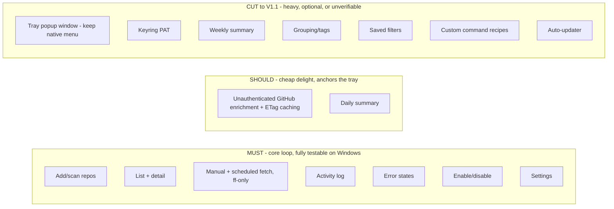
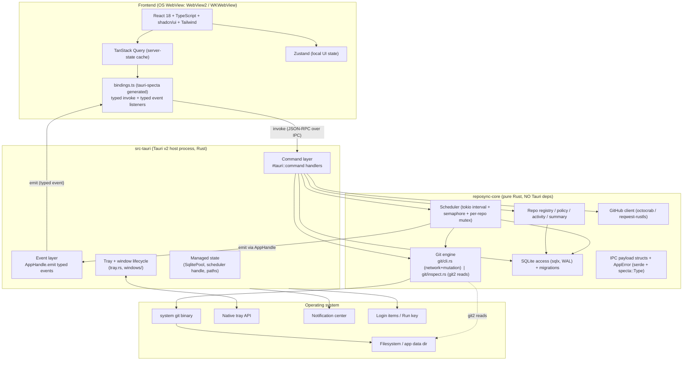
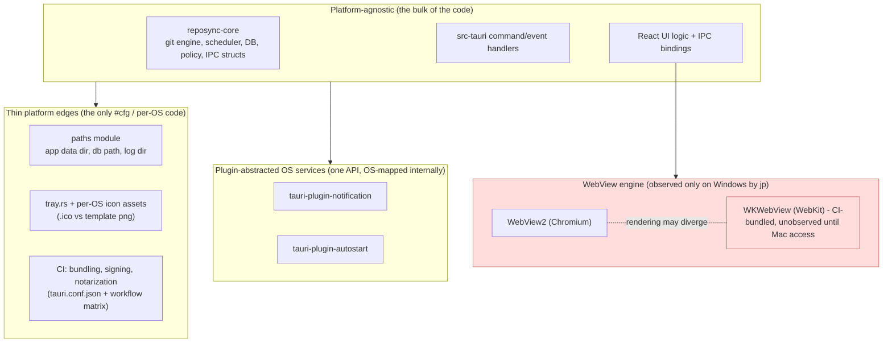
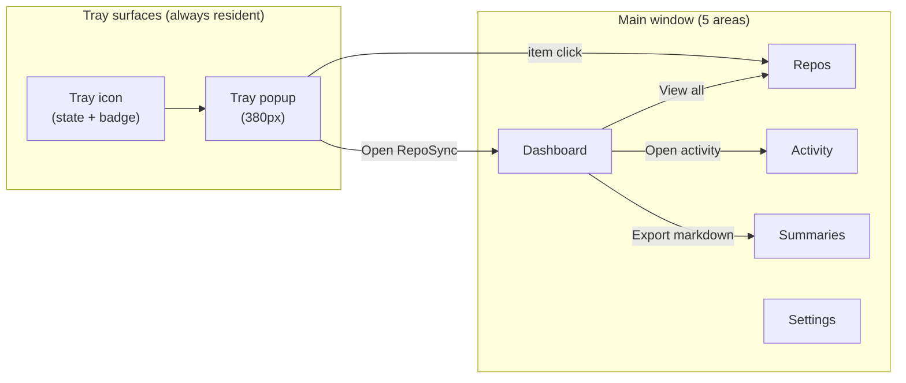
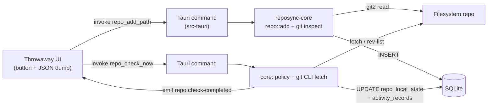
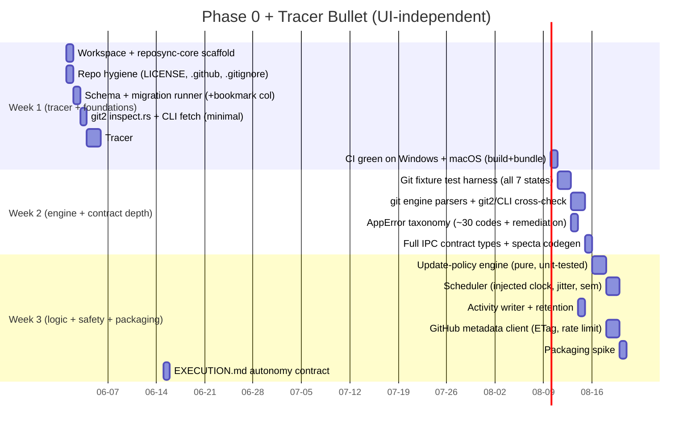

# RepoSync V1, Architecture and Decisions

> A working architecture and decision record for the cross-platform V1. This document captures where a design collaboration between jp and an AI coding agent (Claude) landed: it synthesizes the existing `strategy-and-roadmap.md`, a multi-agent analysis of that plan, the four UI mockups (now archived to `_local/gui/archived-mockups/`, superseded by the Graphite design language in `DESIGN.md`), and the decisions reached in conversation. It is written to be shared.

## 1. What this document is

The `strategy-and-roadmap.md` answered "what should RepoSync be." This document answers "how do we actually execute V1 from where we really stand," and it captures the decisions that fell out of reviewing the plan against one inconvenient fact: the entire roadmap was written as if a two-platform team ships macOS and Windows at once, while the real operator is one person on a Windows-only machine building through AI agents.

It is organized to answer four questions raised in that review:

1. **Why does the Windows-only reality actually matter?** (Section 2)
2. **What is the human and agent autonomy boundary, and where is the V1 scope line?** (Section 3)
3. **What is the architecture, in enough detail to scaffold from?** (Section 4) and **what does the UI and UX commit to?** (Section 5)
4. **What can we build right now, regardless of any UI/UX decision?** (Section 6)

Section 7 lists the concrete next steps and the handful of calls that are jp's to make.

### Decision ledger (status as of this conversation)

This is the running record of where each decision stands. "Decided" means settled in this collaboration. "Ratify" means the recommendation is sound and an agent can proceed unless jp objects. "Needs decision" means it is genuinely jp's call and still open. "Agent default" means an agent will proceed on the listed choice as an engineering decision, flagged for visibility.

| Decision | Status | Owner | Direction |
|---|---|---|---|
| Platform target | **Decided** | jp | True dual-platform, **Windows-first**, maximally common architecture; macOS stays the goal but degrades to "compiles + bundles in CI" until real Mac access exists |
| Human/agent autonomy boundary | Needs ratification | jp | Human-only allowlist + tiered merges; capture in `EXECUTION.md` (Section 3) |
| V1 scope line | Needs ratification | jp | Keep core loop + unauthenticated GitHub enrichment + daily summary; cut the tray popup window, keyring PAT, weekly summary, groups, saved filters, recipes, auto-updater to V1.1 (Section 3) |
| Code signing | Needs decision (money) | jp | Decouple from GA: ship first public build unsigned, add Windows signing via Azure Trusted Signing as a fast-follow; binds at ship, not at start |
| Go-public timing + first commit | Needs decision | jp | Go public at Phase 0 exit; quarantine `docs/internal/` and `_local/` out of public history; one-way door |
| License | Needs decision | jp | MIT default (Apache 2.0 defensible); binds only at first public commit |
| Brand name | Deferred to pre-GA | jp | Keep "RepoSync" working title; isolate the brand string to one constant |
| sqlx macro posture | Agent default (confirm) | agent/jp | Runtime query API (no compile-time `DATABASE_URL`/offline-cache friction), or macros + committed `.sqlx` cache + CI check |
| IPC type generation | Agent default | agent | `tauri-specta`: generate TS from Rust so the contract cannot drift |
| `scoped_bookmark_blob` column | Agent action (Phase 0) | agent | Add to `repos` in the first migration; free hedge with a hard deadline |
| Per-repo git locking | Agent default | agent | Async mutex per repo so scheduled + manual ops cannot corrupt the same working tree |
| WebView2 runtime | Agent default | agent | Evergreen `downloadBootstrapper` to keep the bundle under 30MB |
| App data location | Agent default | agent | `%LOCALAPPDATA%` (never a OneDrive-synced folder) to avoid SQLite WAL corruption |
| git discovery + version floor | Agent default | agent | PATH + known install locations; require git >= 2.30; "git not found" is a first-class state |
| OSS defaults (no telemetry, no crash reporting, DB-only settings, inherit credential helper, check_only/fetch_only/pull_ff_only only, 6h cadence, resident tray) | Ratify | agent | Proceed on the strategy doc's recommendations |

### Table of contents

- [2. Why the Windows-only reality drives everything](#2-why-the-windows-only-reality-drives-everything)
- [3. Decisions that need your ratification: autonomy and scope](#3-decisions-that-need-your-ratification-autonomy-and-scope)
- [4. Architecture](#4-architecture)
- [5. UI and UX](#5-ui-and-ux)
- [6. What we can build now, regardless of UI/UX](#6-what-we-can-build-now-regardless-of-uiux)
- [7. Recommended next steps and what I need from you](#7-recommended-next-steps-and-what-i-need-from-you)

---

## 2. Why the Windows-only reality drives everything


**Plain explanation, from first principles.**

You build this app on a Windows 11 machine, working through AI coding agents. The agents can write code for any platform - Rust and TypeScript do not care which OS they are compiled for. So at the source-code level, "macOS support" looks free: the same files compile for both targets. That is the trap. The fact that matters is not "can the code be written for macOS" (yes) but "can anyone on this project ever **see, run, sign, and judge** the macOS build before users do" (no). A desktop tray app is not just logic. It is a thing a human looks at and clicks, on a specific operating system, every day. Half of that human-verification loop is missing for macOS, and no amount of agent code closes that gap. Here is exactly where the gap bites.

**1. Half the Phase 0/1 acceptance criteria literally cannot be checked by the one human on the project.**
Look at the Phase 0 acceptance list: "App launches on macOS and Windows from `pnpm tauri dev`," "Tray icon visible; right-click shows native menu." Phase 1 adds memory-footprint targets "under 200 MB on macOS," "cold-start under 3 seconds," and "the app survives loss of network, missing local path, deleted upstream, detached HEAD without crashing." Every one of those macOS clauses is a claim about runtime behavior on a Mac. The only human on this project cannot open a Mac, launch the app, watch the tray icon appear, and confirm it. "CI compiled it and produced a `.app`" is a genuinely weaker statement than "a human opened the menu-bar app and it worked." CI proves the code type-checks, links, and bundles. It does not prove the icon is visible, the popup is positioned correctly, the memory target is met, or that a yanked upstream surfaces a clean error state instead of a beachball. So if the acceptance criteria keep saying "and macOS," you are signing your name to assertions you have no way to verify. That is not a small process wrinkle. It means the V1 "done" definition contains line items that are structurally unprovable by your team.

**2. macOS code signing and notarization REQUIRE a Mac plus an Apple Developer account. You cannot notarize from Windows.**
Phase 1 deliverable 13.1 is "Signed .app and .dmg for macOS." Notarization is Apple's process where you upload the signed app to Apple, they scan it, and they staple a ticket to it so Gatekeeper lets ordinary users open it without the "unidentified developer" block. The tools that do this - `codesign`, `xcrun notarytool`, `stapler` - ship only inside Xcode command-line tools, which run only on macOS. There is no Windows port and no cross-compile path. It also requires a paid Apple Developer Program enrollment (about USD 99/year), which needs a credit card and identity verification. Concretely: a signed, notarized macOS build cannot be produced on your machine at all. It can only come from a macOS CI runner (GitHub Actions provides these) holding your Apple credentials as secrets, or from a physical Mac. Until that pipeline exists and is fed real Apple credentials, "signed .dmg" is not a deliverable you can hit, only one CI can hit on your behalf once secrets are loaded.

**3. The macOS webview is WKWebView, not WebView2. Your most visually delicate UI ships blind on Mac.**
The strategy doc (section 3.1) already notes Tauri uses "WebView2 on Windows, WKWebView on macOS." These are two different browser engines. Your frontend renders inside whichever the host OS provides. That means CSS and rendering can differ between the two: `backdrop-filter` (the frosted-glass effect planned for the tray popup), font smoothing and metrics, native window vibrancy, scrollbar behavior, and subpixel layout can all look or behave differently under WKWebView. On Windows you will see exactly what users see, because you run WebView2. On macOS you will **never** see the WKWebView render with your own eyes before release. So a frosted popup that looks crisp on Windows could render muddy, mispainted, or with a visible seam on macOS, and the first person to notice would be a Mac user filing a GitHub issue. Visual bugs on macOS ship blind.

**4. The tray / menu-bar UX, the single most important surface, behaves differently on macOS and is unvalidatable.**
This app *is* its tray presence. Section 3.11 splits the surface into a native menu (right-click) and a frameless popup window positioned near the icon (left-click). macOS menu-bar extras and Windows notification-area icons differ in click semantics, popup anchoring, how the icon participates in dark/light menu bars, template-image tinting, and what happens on multi-monitor or notched displays. The geometry math that positions the popup under the icon is OS-specific. On Windows you will click the icon a hundred times during development and feel whether it is right. On macOS you cannot click it once. The highest-value, highest-touch surface of the product is exactly the one you cannot drive on the platform you cannot run.

**5. A "6-week cross-platform V1" estimate is fiction while half of it is unbuildable and untestable locally.**
The roadmap budgets Phase 1 at roughly six weeks and folds macOS packaging plus dual-OS QA into that number. But you cannot interactively debug the Mac build, cannot click its tray, cannot eyeball its popup, and cannot run its signing locally. Work you cannot do interactively does not take "a bit longer," it takes an unbounded amount longer, because the tighten-and-retry loop that makes estimates real (change, run, look, fix) is broken for macOS. Any single estimate that treats Windows and macOS as one homogeneous six-week block is mixing a tractable task with an untestable one and reporting the average as if it were solid. That is how timelines quietly become fiction.

### Context

The end goal is genuinely dual-platform; that is not in dispute and the platform-strategy memo already ratifies it. The tension is purely about **verification capacity and money**, not ambition. The resolution has to keep macOS a first-class target without pretending you can validate it today.

### Options

| Option | What it means | Tradeoffs |
| --- | --- | --- |
| 1. Windows-only V1, drop macOS entirely from the codebase | Strip platform abstractions, ship one OS | Cheapest now; but re-adding macOS later is a costly retrofit and contradicts the stated end goal. Throws away Tauri's main cross-platform advantage. |
| 2. True dual-platform, ship both at GA simultaneously | Hold Windows GA until macOS is fully validated | Honors "dual-platform" maximally but blocks your shippable Windows build behind a Mac you do not have. Indefinite delay. |
| 3. True dual-platform, **Windows-first**, common architecture, macOS kept honest in CI, staged macOS GA later | Build platform-agnostic; Windows is first real GA; macOS = "compiles + bundles in CI" until Mac access exists, then a later macOS GA | Slightly more upfront discipline (abstractions, CI matrix); keeps macOS first-class and cheap to finish; quarantines the unverifiable work. |

### Recommendation

**Option 3, which is exactly the decision already recorded in the platform-strategy memo. Ratify and operationalize it as follows.**

- **Keep macOS a first-class goal.** All platform-touching code lives behind abstractions (tray, paths, autostart, notifications, keyring) so the Mac port stays a thin, well-bounded surface rather than a rewrite.
- **Use CI as the honesty mechanism, not the acceptance mechanism.** The macOS GitHub Actions runner must keep the Mac build **compiling and bundling** on every change. That prevents silent bit-rot. But CI-green is explicitly downgraded from "accepted" to "not broken." Rewrite the acceptance criteria per platform:
  - Windows: launches + human-validated + signed (this is the real GA bar).
  - macOS: compiles + bundles in CI, no human-validated or signed clause, until real Mac access exists.
- **Quarantine the unverifiable macOS work into a later staged GA.** macOS signing, notarization, tray-popup geometry validation, and WKWebView visual QA all wait for one of: a used Apple Silicon Mac mini (a modest one-time purchase, your own hardware, best long-term), or a cloud Mac (MacStadium or MacinCloud, rentable by the hour or month, zero hardware commitment, good for a signing-and-QA sprint). Either unlocks the full macOS acceptance pass; neither is needed to ship Windows.

This keeps your first ship real and on your own machine, keeps macOS alive and cheap to finish, and stops you from certifying things you cannot see.


---

## 3. Decisions that need your ratification: autonomy and scope


### The human and agent autonomy boundary

**Plain explanation, from first principles.**

This project is built by an AI agent (me) writing and iterating on the code, with you as the single human operator. That works for almost everything: I can scaffold, write Rust and TypeScript, author tests, run CI, and open PRs all day without you in the loop. But a few actions are things an agent **cannot** do or **should not** do alone. They fall into four buckets, and the buckets are what define the line:

- **Money.** Some steps cost money and require a payment instrument and a billing identity. An agent has no credit card and no legal standing to enter into a paid program.
- **Legal identity.** Some steps require proving who the human owner is (Apple's and a certificate authority's identity verification). The agent is not a legal person and cannot attest to identity.
- **Irreversibility.** Some steps cannot be cleanly undone: rewriting published history, force-pushing over a shared branch, deleting a tag others may have fetched. A human should hold the trigger on anything that is hard to walk back.
- **Publishing.** Some steps make work public or canonical: flipping the repo from private to public, merging to the default branch, cutting a release tag the world can install. These are decisions about what the project *says to the outside world*, which is an owner's call, not an agent's.

The decision is: **draw an explicit allowlist of human-only actions, let the agent be autonomous everywhere else, and place checkpoints (CI gates, PRs) at the boundary.** Here are the two concrete lists.

**AGENT-SAFE actions (no human required, agent proceeds autonomously):**
- Scaffold the Tauri + React + Rust project and workspace.
- Write and refactor Rust and TypeScript source.
- Author and update unit, integration, and UI tests.
- Run CI locally and in GitHub Actions; iterate until the matrix is green.
- Run `cargo check`, `clippy`, `cargo test`, `pnpm typecheck`, `pnpm lint`, `pnpm tauri dev` on Windows.
- Create feature branches and commit to them.
- Open and update **draft** pull requests.
- Iterate on review feedback and keep CI green.
- Build unsigned local artifacts for inspection.

**HUMAN-ONLY actions (agent must stop and hand off), and *why*:**

| Action | Why it is human-only |
| --- | --- |
| Apple Developer Program enrollment | Money (paid annual fee) + legal identity verification |
| Windows code-signing certificate procurement | Money + organizational/identity validation by a certificate authority |
| Storing signing / notarization secrets in CI | Custody of credentials and legal responsibility for their use |
| Flipping the repo from private to public | Publishing decision; irreversible in practice (the world may have cloned it) |
| Merging to the default branch | Canonical-state decision; sets what the project officially *is* |
| Cutting a public release tag / GitHub Release | Publishing; users will install it; effectively irreversible |
| Any force-push or history rewrite on a shared branch | Irreversibility; destroys recoverable history for collaborators |

The principle: anything that spends money, asserts a legal identity, publishes to the world, or cannot be cleanly undone stays with the human. Everything upstream of that line is agent-autonomous.

#### Context

You already have a standing rule that the agent commits and pushes only when asked, and branches first. The autonomy boundary is the natural extension of that rule into a project policy: it says where "go ahead without asking" applies and where the agent must hand back to you.

#### Options

| Option | Model | Tradeoffs |
| --- | --- | --- |
| 1. Full autonomy with CI gates, human only for the allowlist | Agent self-merges anything CI-green except allowlist items | Fastest throughput; but with a public repo, self-merging to default means unreviewed code becomes canonical. |
| 2. Human-gated merges | You review every PR before merge | Maximum control; but you become the bottleneck on routine green changes, slowing the agent's main advantage. |
| 3. Tiered by repo visibility | Autonomous self-merge while repo is **private/pre-public**; human-reviewed merges once **public** | Matches risk to stakes: low-stakes while nobody can see it, careful once the world can. |
| 4. Explicit human-only allowlist, agent autonomous everywhere else | The two lists above are the contract | Clear, auditable boundary; needs the allowlist kept current as the project grows. |

#### Recommendation

**Option 4 layered on Option 3, which aligns with your standing "commit/push only when asked, branch first" rule.**

- The human-only allowlist (Option 4) is the hard boundary: those seven actions always stop and hand off, regardless of phase.
- Merge policy follows repo visibility (Option 3): while the repo is private and pre-public, the agent may self-merge green PRs to move fast; the moment the repo flips public (itself a human-only act), merges to the default branch become human-reviewed.
- This composes cleanly with your standing rule: the agent still branches first and pushes/commits when the workflow calls for it, but the *merge* and *publish* gates are now explicit rather than implicit.

**Ready-to-use `EXECUTION.md` outline (drop-in skeleton):**

```markdown
## EXECUTION.md - How this project gets built and shipped

### Roles
- Operator (human): jp. Holds money, identity, and publishing authority.
- Agent: drives code, tests, CI, and draft PRs.

### Agent-safe (proceed without asking)
- Scaffold, write Rust/TS, author tests
- Run CI locally and in Actions; iterate to green
- Create feature branches; commit to them
- Open and update draft PRs
- Build unsigned local artifacts

### Human-only (stop and hand off, with reason)
- Apple Developer enrollment            (money + identity)
- Windows code-signing cert             (money + identity)
- Store signing/notarization secrets    (credential custody)
- Repo private -> public                 (publishing, irreversible)
- Merge to default branch               (canonical state)
- Cut public release tag / Release      (publishing, irreversible)
- Force-push / history rewrite          (irreversible)

### Merge policy (by visibility)
- Repo private/pre-public: agent may self-merge green PRs
- Repo public: merges to default branch require human review

### CI gates (the boundary checkpoints)
- Required green before any merge: cargo check, clippy -D warnings,
  cargo test, pnpm typecheck, pnpm lint
- Build matrix: Windows (real GA bar) + macOS (compiles + bundles only)

### Standing rules
- Agent branches first; commits/pushes per workflow
- Co-authored-by trailer on commits
- No force-push without explicit human go-ahead
```

---

### Where the V1 scope line sits

**Plain explanation, from first principles.**

Phase 1 currently packs roughly 13 deliverable groups (repo discovery, list view, detail panel, git engine, update modes, scheduler, activity log, GitHub metadata, daily summary, tray, notifications, settings, packaging) into a ~6-week window for one developer plus agents. The problem is that these groups are not equal in size or in *testability on your machine*. A few are large sub-projects, and several of those large ones are exactly the items hardest to test on Windows-only hardware. If everything stays "in V1," the timeline is only real if nothing slips, and the things most likely to slip are the ones you can least control. The decision is: **what is truly in V1 versus deferred to V1.1, so the first ship is achievable and the advertised V1 surface is honest.** Walk through the heavy items and what they actually cost.

- **The separate frameless tray POPUP window (deliverable 10.2).** This is distinct from the cheap native right-click menu (10.1), which Tauri gives you almost for free. The popup is a second webview window you position by hand near the tray icon. The geometry - anchoring under the icon, handling multi-monitor, DPI scaling, the notch on Macs, click-outside-to-dismiss - is fiddly and OS-specific. And per section A, you cannot validate its macOS behavior at all. High effort, partly unverifiable.
- **The keyring-backed GitHub PAT flow (deliverable 8.2).** This is a three-platform secrets surface (Windows Credential Manager, macOS Keychain, and the abstraction over them) built for an **optional** feature. What does the PAT actually buy? It only lifts GitHub's unauthenticated rate limit (60 requests/hour) up to the authenticated limit. For a personal library checked a few times a day with ETag caching, 60/hour is rarely the binding constraint. You would be building a cross-platform credential vault to relax a limit most users will not hit.
- **GitHub metadata enrichment (deliverable 8.1).** Fetching description, default branch, and latest release is genuine delight and anchors the tray's "new releases" line. The *unauthenticated* version of this is cheap. The expensive part is only the PAT layer above it.
- **Daily summary (deliverable 9).** A nightly in-app card summarizing what changed. Moderate cost, high delight, and it is what makes the tray feel alive.
- **Notifications (deliverable 11).** OS-native toasts for new releases, failures, auth issues. Per-platform behavior and another surface to QA on a Mac you cannot run.
- **Dual-OS signed packaging (deliverable 13).** Per section A, the macOS half cannot be produced or validated on your machine at all. This is the single most likely silent buffer-eater: it looks like "1-2 days" in the risk list, but for macOS it is gated on hardware and credentials you do not yet have.

#### Context

This is an OSS personal-utility tool, not a commercial product, so the cost of a tighter V1 is low: there is no revenue or contract riding on a broad first surface. The dominant risk for this project is **maintenance commitment and timeline honesty**, not feature breadth. A smaller, shippable, fully-validated V1 serves the project's actual goals better than a broad V1 that slips or ships unverified.

#### Options - MUST / SHOULD / CUT-to-V1.1 tiering



| Tier | Items | Rationale |
| --- | --- | --- |
| **MUST** | Add/scan repos; list + detail; manual + scheduled fetch + ff-only; activity log; error states; enable/disable; settings | This is the whole reason the app exists, and every piece is fully testable on Windows. Without this there is no product. |
| **SHOULD (keep)** | Lightweight **unauthenticated** GitHub enrichment with ETag caching; daily summary | Cheap to build, high delight, and they anchor the tray's value (new releases, "what changed today") without the cross-platform secrets surface. |
| **CUT to V1.1** | Tray popup window (keep the native right-click menu); keyring PAT; weekly summary; grouping/tags; saved filters; custom command recipes; auto-updater | Each is either heavy, optional, or unverifiable on Windows-only hardware. The native menu covers the essential tray interaction; the popup is polish. |

> **Superseded 2026-06-30 (grouping/tags):** grouping/tags was later promoted out of this CUT set into the **v0.9.0** initial release (feature committed, schema ready, spec deferred until the GUI is finalized). This table (and the diagram above) preserve the original ratified proposal as the historical record; the live scope ledger and its dated amendment are in [program-roadmap.md](program-roadmap.md), and the product framing is in [release-plans/plan_v0.9.0/features-and-outcomes.md](release-plans/plan_v0.9.0/features-and-outcomes.md) Section 3.

The key moves: **keep the native tray menu, cut the popup window to V1.1** (you get a working tray without the unverifiable geometry); **cut the keyring PAT to V1.1** but **keep unauthenticated enrichment** (you get the delight without the three-platform vault); and **explicitly treat macOS signed packaging as the most likely silent buffer-eater**, gated on Mac access per section A.

#### Recommendation

**Ratify the MUST / SHOULD / CUT tiering above, and add pre-committed descope TRIGGERS so any slippage produces a principled cut instead of a silent slide.** A trigger is a rule you agree to *now*, before the pressure hits, of the form "if X is not done by week N, cut Y." Suggested triggers:

- If the **tray popup window** is not stable on Windows by end of week 4, cut it to V1.1 and ship with the native menu only.
- If **macOS signing/notarization** is not unblocked (Mac access + credentials) by end of week 4, drop macOS from the V1 GA bar entirely and ship Windows-only GA, with macOS as a staged later GA. Treat this as the most likely buffer-eater and watch it first.
- If **GitHub enrichment** is not green by end of week 5, ship V1 with local git state only and add enrichment in a fast-follow.
- If the **daily summary** is not done by end of week 5, cut it to V1.1 (it is SHOULD, not MUST).

Triggers convert slippage from a quiet timeline failure into a deliberate, pre-agreed scope decision.

**This is your call to RATIFY, because it changes the advertised V1 surface.** Cutting the tray popup, the PAT, weekly summary, grouping/tags, saved filters, recipes, and the auto-updater narrows what V1 publicly promises. The roadmap doc currently lists several of these inside Phase 1; ratifying this tiering moves them to Phase 2 (V1.1) on paper as well as in plan. Since the project is OSS and the dominant risk is timeline honesty and maintenance load, a tighter, fully-validated, Windows-first V1 with an explicit V1.1 backlog is the recommended posture - but the descope is a product-surface decision that is yours to confirm, not the agent's to make unilaterally.


---

## 4. Architecture


This section is the engineering core of the V1 brief. It specifies the runtime model, the "common-as-possible, Windows-first" portability strategy, the workspace split, the typed IPC contract, the data model and its one urgent Phase-0 schema action, the git engine boundary, the scheduler with a correctness fix the roadmap missed, the tray model, the security model, and a set of Windows-ship decisions that the strategy doc never named. It is written to be scaffolded from directly.

### 1. System overview

RepoSync is a single-process Tauri v2 desktop application. There is one native host process (Rust) that owns:

- the **Tokio async runtime** (shared with Tauri, not a second runtime),
- the **SQLite connection pool**,
- the **scheduler** (one interval task fanning out bounded concurrent git work),
- the **git engine** (subprocess + `git2` reads),
- the **tray icon, native menu, and webview window lifecycle**.

The UI is HTML/CSS/JS rendered by the **OS-provided WebView**, not a bundled Chromium: **WebView2 (Edge/Chromium) on Windows**, **WKWebView (Safari/WebKit) on macOS**. This is the property that gives Tauri its small footprint and is also, as Section 2 below makes explicit, the single largest cross-platform rendering risk for a Windows-first build.

Communication between the WebView frontend and the Rust host is exclusively over Tauri's IPC bridge: the frontend `invoke`s **commands** (request/response) and `listen`s for **events** (server-push). There is no business logic in JavaScript and no direct filesystem or process access from the WebView; both are mediated by Rust commands gated through Tauri v2 capabilities.



Three layers, one direction of dependency: **frontend depends on the IPC contract; the command/event layer depends on `reposync-core`; `reposync-core` depends only on the OS and crates, never on Tauri.** That last constraint is what makes the macOS port and the test story cheap (Sections 2 and 3).

### 2. "Common architecture as possible, Windows-first" strategy

This is the new load-bearing framing and it changes how the codebase is structured. The end goal is a true dual-platform app (macOS + Windows). The shipping reality is that jp's only machine is Windows 11, so he cannot interactively run, sign, notarize, or QA a macOS build. The strategy is therefore:

> Make as much of the system platform-agnostic as possible, push every unavoidable platform difference behind a small, named seam, and let the macOS targets degrade to "compiles and bundles in CI" until real Mac hardware exists. Windows is the first real GA.

The design rule that operationalizes this: **platform-specific code is a thin edge, never a fork.** There is no `#[cfg]` sprinkled through business logic. Platform differences live in three places only: (a) a `paths` module, (b) tray/asset code in `src-tauri`, and (c) the CI/bundling config. Everything in `reposync-core` is `#[cfg]`-free.

#### What is shared vs platform-specific

| Concern | Shared or platform-specific | How it is isolated |
|---|---|---|
| Git engine (shells to `git`, `git2` reads) | **Shared** | One code path on both OSes. Only the *discovery* of the git executable differs (a string from the `paths`/settings layer), not the engine. See Section 6 and 10. |
| SQLite persistence (sqlx, WAL, migrations) | **Shared** | Identical schema and queries. Only the DB *file location* is platform-specific, resolved by the `paths` module (Section 10). |
| Scheduler (interval, jitter, semaphore, per-repo lock) | **Shared** | Pure Tokio + chrono in `reposync-core`. No OS scheduler in V1, so nothing platform-specific to abstract. |
| IPC contract (commands, events, payload structs) | **Shared** | Tauri's IPC is cross-platform by construction. Types generated once via tauri-specta (Section 4). |
| GitHub client / metadata | **Shared** | `reqwest` with **rustls** (not OpenSSL) so there is no platform TLS/native-deps divergence. |
| Notifications | **Shared API, plugin abstracts OS** | `tauri-plugin-notification` presents one API; the plugin maps to Windows toast vs macOS Notification Center. Call sites stay identical. |
| Autostart / launch-at-login | **Shared API, plugin abstracts OS** | `tauri-plugin-autostart` presents one API; maps to the Windows `Run` registry key vs a macOS LoginItem. Settings store a single boolean. |
| Tray icon assets + native menu | **Platform-specific** | macOS wants template images (OS-tinted, @2x retina); Windows wants multi-size `.ico` (16/20/24/32/48). Menu chrome and click semantics differ. Isolated in `src-tauri/src/tray.rs` plus per-OS asset folders selected at build/runtime via `tauri-plugin-os`. |
| File paths / app-data / log dirs | **Platform-specific** | `%APPDATA%`/`%LOCALAPPDATA%` vs `~/Library/Application Support`. Isolated behind a single `paths` module (Section 10) that returns resolved `PathBuf`s; nothing else computes a path. |
| Packaging / signing / notarization | **Platform-specific (CI only)** | MSI/NSIS + Authenticode (Windows) vs `.app`/`.dmg` + codesign/notarize (macOS). Lives entirely in `tauri.conf.json` bundle config and the CI matrix, never in app code. |
| WebView rendering (CSS/JS quirks) | **Platform-specific runtime behavior, not a code seam** | WebView2 (Chromium) and WKWebView (WebKit) are different engines. The same CSS/JS can render or behave differently (flexbox edge cases, backdrop-filter, font smoothing, scrollbar styling, date inputs, `position: sticky`). **This is a real Windows-first risk** because jp can only observe WebView2. Mitigation in this section below. |

#### The platform-abstraction boundary



**WebView-divergence mitigations (Windows-first):**

- Treat WKWebView as the stricter target by policy. Prefer well-supported, conservative CSS; avoid effects with known WebKit/Chromium divergence (e.g., `backdrop-filter`, custom scrollbar styling, native `<input type="date">`) unless verified on both. Lean on shadcn/Radix primitives, which are already cross-engine tested, rather than hand-rolled CSS.
- Pin a CI Linux WebKitGTK smoke target. WebKitGTK is not WKWebView, but it catches a meaningful share of WebKit-vs-Chromium CSS/JS divergences for free, with no Mac hardware.
- Keep a written "verify on Mac before GA" checklist of UI surfaces (tray popup layout, modal blur, list virtualization, font rendering). The macOS UI does not need to be QA-clean to pass Phase 0/1 ("compiles + bundles in CI"), but the checklist makes the eventual Mac pass a bounded task, not an open-ended one.

### 3. Cargo workspace layout

The workspace splits into a logic crate with **zero Tauri dependencies** and a thin Tauri shell.

```
repo-sync-tool/
├─ Cargo.toml                 # [workspace]: members = ["crates/reposync-core", "src-tauri"]
├─ crates/
│  └─ reposync-core/          # NO tauri, NO tauri-* deps
│     ├─ src/
│     │  ├─ lib.rs
│     │  ├─ error.rs          # AppError (thiserror; serde + specta::Type)
│     │  ├─ ipc.rs            # IPC payload structs (RepoSummary, CheckResult, ...)
│     │  ├─ repo.rs
│     │  ├─ policy.rs
│     │  ├─ scheduler.rs
│     │  ├─ activity.rs
│     │  ├─ summary.rs
│     │  ├─ github.rs
│     │  ├─ paths.rs          # platform path resolution (the path seam)
│     │  └─ git/
│     │     ├─ mod.rs         # GitEngine trait
│     │     ├─ cli.rs         # network + mutation (shell to git)
│     │     └─ inspect.rs     # cheap reads (git2)
│     └─ migrations/          # sqlx numbered .sql files
└─ src-tauri/                 # depends on reposync-core + tauri + plugins
   └─ src/
      ├─ main.rs              # builder, managed state, tauri-specta export
      ├─ commands/            # #[tauri::command] thin wrappers over core
      ├─ events.rs            # typed event emit helpers
      ├─ tray.rs              # tray + native menu (platform-specific chrome)
      └─ windows/             # main window + frameless tray popup
```

**Why the split matters:**

1. **Testability.** `reposync-core` compiles and tests without a running Tauri app, a WebView, or a display server. The scheduler, git parsing, policy engine, and migrations can be unit- and integration-tested in plain `cargo test` and in CI on any OS, including headless Linux. If logic lived in `src-tauri`, every test would drag in the GUI host.
2. **The macOS port is a thin edge.** Because all platform-specific behavior is confined to `paths.rs`, `tray.rs`, the per-OS assets, and CI config, the macOS port touches a small, enumerable set of files. The crate that holds the actual product behavior is identical on both platforms.
3. **IPC payload types are owned by core, not the shell.** `AppError` and every payload struct (`RepoSummary`, `RepoDetail`, `CheckResult`, etc.) live in `reposync-core::ipc` and derive `serde::Serialize/Deserialize` plus `specta::Type`. The command layer in `src-tauri` is a thin set of `#[tauri::command]` functions that call into core and return these types. This keeps the contract definition independent of Tauri and makes the type-generation story in Section 4 clean.

A note on dependency hygiene: `reposync-core` must not pull `tauri` even transitively. Enforce with a CI check (e.g., `cargo tree -p reposync-core | grep -i tauri` must be empty). `specta` itself is fine in core because it is not a Tauri dependency; only `tauri-specta` (the glue) lives in the shell.

### 4. The IPC contract as the API

The IPC boundary is the product's real API surface. For an agent-driven build by a single developer, the largest avoidable failure mode is **contract drift**: the Rust command signature and the hand-written TypeScript wrapper diverging silently, producing runtime `undefined`s that the type checker never catches.

**Command surface (Phase 1), grouped:**

- **Registry:** `repo_list(filter) -> Vec<RepoSummary>`, `repo_get(id) -> RepoDetail`, `repo_add_path(path) -> RepoId`, `repo_scan_parent(path) -> ScanResult`, `repo_remove(id)`, `repo_set_enabled(id, bool)`, `repo_set_policy(id, UpdatePolicy)`.
- **Git ops:** `repo_check_now(id) -> CheckResult`, `repo_update_now(id, UpdateMode) -> UpdateResult`, `repo_refresh_metadata(id) -> RepoDetail`.
- **Quick actions:** `repo_open_folder/terminal/editor/remote(id)`.
- **Activity / summaries:** `activity_list(filter) -> Vec<ActivityRecord>`, `summary_today() -> DailySummary`, `summary_week() -> WeeklySummary`.
- **Settings:** `settings_get() -> Settings`, `settings_set(Settings)`.

**Event surface (server-push):** `repo:state-changed`, `repo:check-started/completed`, `repo:update-started/completed`, `scheduler:tick`, `notification:fired`, `error:raised`. Each carries a typed payload (see Section 3.9 of the strategy doc). The frontend listens and invalidates the corresponding TanStack Query keys; no JS-side polling.

**Strong recommendation: generate the TypeScript contract from Rust with `tauri-specta`.** Make the Rust types the single source of truth. The workflow:

1. Annotate each command with `#[tauri::command]` and `#[specta::specta]`.
2. Derive `specta::Type` on every payload struct and on `AppError` (these already live in `reposync-core::ipc`).
3. In `main.rs`, collect with `tauri_specta::Builder::new().commands(collect_commands![...]).events(collect_events![...])` and call `.export(...)` to emit `src/lib/bindings.ts`, guarded by `#[cfg(debug_assertions)]` so production builds do no file I/O.
4. The frontend imports the generated typed `commands.*` and `events.*` instead of calling raw `invoke`/`listen`. Renaming a Rust field or changing a return type now breaks the TypeScript build, which is exactly the guardrail an agent build needs.

tauri-specta v2 generates types for **both commands and events** (the event-type generation is a v2 addition over v1), so the entire contract above is covered, not just the commands.

**Version-status caveat (verify before pinning):** As of the latest published docs, tauri-specta v2 is at **release-candidate** stage (Context7 surfaces `2.0.0-rc.21`; the project describes v2 as beta until Tauri v2 fully stabilizes, "safe to use as long as you lock your versions"). Action: confirm the current `tauri-specta` and `specta` versions at scaffold time, pin them exactly in `Cargo.toml` (consistent with risk 8.8's "pin all Tauri-related crates" posture), and re-check at each quarterly dependency review. If the RC ever proves unstable for this build, the fallback is a single hand-maintained `bindings.ts` plus a CI test that round-trips a sample of each payload through `serde_json` against a TS-side schema; this is the contingency, not the plan.

Sources: [specta-rs/tauri-specta](https://github.com/specta-rs/tauri-specta), [tauri-specta v2 docs](https://github.com/specta-rs/website/blob/main/content/docs/tauri-specta/v2.mdx), [docs.rs/tauri-specta](https://docs.rs/tauri-specta), [Tauri 2.0 stable release](https://v2.tauri.app/blog/tauri-20/).

### 5. Data model

The V1 schema (full DDL in strategy Section 4.2) is six logical areas:

| Table | Role | Key fields |
|---|---|---|
| `repos` | Core registry, one row per tracked repo | `local_path UNIQUE`, `remote_origin_url`, `host_type`, `default_branch`, `update_mode`, `check_frequency_min` (default 360 = 6h), `enabled` |
| `repo_local_state` | Cached local git state, refreshed each check (1:1 with `repos`) | `head_sha`, `ahead_count`, `behind_count`, `is_dirty`, `is_detached`, `last_checked_at`, `last_updated_at`, `last_error_code`, `next_check_at` |
| `repo_remote_meta` | Cached host metadata, refreshed less often (1:1 with `repos`) | `description`, `topics_json`, `latest_release_tag/at/url`, `is_archived`, `last_remote_sha`, `last_fetched_at` |
| `activity_records` | Append-only audit trail of every git invocation | `action_type`, `status`, `raw_command`, `raw_stdout`, `raw_stderr`, `exit_code`, `duration_ms`; indexed by `(repo_id, timestamp DESC)` and `(timestamp DESC)` |
| `groups` + `repo_groups` | Tagging / grouping (N:M) | `groups.name UNIQUE`, join table |
| `settings` | Singleton row (`CHECK (id = 1)`) | global frequency, quiet hours, notification toggles, `git_executable_path`, editor/terminal commands, autostart, retention, `github_token_present` |

**Migration strategy.** Numbered `.sql` files under `crates/reposync-core/migrations/`, applied at startup via `sqlx::migrate!` (embedded at compile time). Post-V1 the schema is **additive-only**: new columns with defaults, new tables, never destructive renames or drops (strategy 4.3). Pre-V1 the schema may be reset freely; document that in the README. Migration-failure behavior at startup is a Windows-ship decision, covered in Section 10.

**Concrete Phase-0 action (do this before the first migration freezes):** add a nullable `scoped_bookmark_blob TEXT` column to `repos` in the initial migration.

```sql
-- in the v1 CREATE TABLE repos (...)
scoped_bookmark_blob TEXT,   -- reserved: macOS App Store security-scoped bookmark
```

Rationale: macOS App Store distribution (a possible V2/V3 path, risk 8.6 and Phase 4) requires sandboxing, and sandboxed apps need a **security-scoped bookmark** to retain access to a user-picked folder across launches. That bookmark is opaque binary data that belongs next to the repo's `local_path`. Because the migration policy forbids destructive changes after V1 ships, adding the column later is cheap but adding it *now*, while the schema is still resettable, is free and risk-free. The column stays `NULL` on Windows and in non-sandboxed macOS builds; it costs nothing until MAS is actually pursued. Pair it with the discipline from risk 8.6: never re-resolve a repo path from the JS side; the backend owns path resolution and would own bookmark resolution.

### 6. Git engine

**The boundary rule (one sentence, memorize it):** if an operation hits the network or writes the working tree, it goes through the `git` CLI; if it is a cheap local read, it goes through `git2`.

| Operation | Path | Why |
|---|---|---|
| `fetch`, `pull --ff-only`, anything touching a remote | **CLI** (`git/cli.rs`) | Inherits the user's system credential helper (risk 8.2); bug-compatible with what the user sees in their terminal (risk 8.7). |
| Working-tree mutation | **CLI** | Same credential/behavior compatibility; full stdout/stderr/exit-code capture for the audit trail. |
| HEAD SHA, branch list, `status` (dirty), ahead/behind counts | **git2** (`git/inspect.rs`) | Fast, no process spawn, no parsing fragility for cheap reads. |

**Module split.** `git/cli.rs` owns subprocess execution via `tokio::process::Command` (decision 9.7: the frontend never spawns processes, so no subprocess plugin is needed), capturing `raw_command`, `raw_stdout`, `raw_stderr`, `exit_code`, and `duration_ms` straight into `activity_records`. `git/inspect.rs` owns `git2` reads. Both sit behind a `GitEngine` trait declared in `git/mod.rs`.

**Why the trait matters - the libgit2 sub-decision.** `git2` links `libgit2-sys`, a C dependency, and C build dependencies are exactly where Windows-first builds tend to bleed time. Decisions:

- **Pin `libgit2-sys` with the `vendored` feature** so the C library is built from source and bundled, rather than depending on a system `libgit2` being present. This is the more reproducible choice on Windows CI.
- **Disable network transport features (no OpenSSL, no libssh2).** All network traffic goes through the CLI by the boundary rule, so `git2` never needs HTTPS or SSH transports. Dropping those features removes the OpenSSL dependency entirely, which is the single biggest source of Windows native-build friction. (This mirrors the rustls-over-OpenSSL choice for the GitHub client.)
- **Put `git2` behind the `GitEngine` trait** so that if the `libgit2-sys` build ever fights the Windows toolchain, falling back to an **all-CLI implementation** of the read operations is a localized change (a second trait impl), not a rewrite. The boundary rule already means CLI is correct for everything that matters; `git2` is purely a read-performance optimization that must be cheap to abandon.

### 7. Scheduler

Resident-only model (no OS scheduler in V1, decision and risk 8.9): checks happen only while the app is running.

- **One `tokio::time::interval`** ticks every minute.
- **On each tick**, query the DB for repos where `enabled = 1` AND `next_check_at <= now()` AND not inside quiet hours.
- **Fan out through a bounded `Semaphore` (default 4 concurrent)** so disk and the GitHub API are not thrashed.
- **On startup**, run due repos immediately but stagger with **jitter (random 0-30s)** to avoid a thundering herd on metered networks.
- **After each job**, update `last_checked_at`/`last_updated_at`, recompute `next_check_at`, write an `activity_records` row, and emit the relevant events. The scheduler holds only short DB transactions and never holds a lock across a network call.

**Correctness decision the strategy doc misses: per-repo locking.** The doc has a global concurrency semaphore but no per-repo serialization. The hazard: a scheduled check for repo X fires at the same moment the user clicks "Check now" on repo X (or two scheduled cycles overlap on a slow repo). Two `git` processes then run in the same working tree concurrently. Git protects its index with `index.lock`, but concurrent invocations can still produce `fatal: Unable to create '.../index.lock': File exists` failures, partial fetches, or, in the worst interleavings, a corrupted index. The semaphore prevents *too many* git ops globally; it does nothing to prevent *two ops on the same repo*.

**Recommendation: a per-repo async mutex.** Maintain a `HashMap<RepoId, Arc<tokio::sync::Mutex<()>>>` (e.g., behind a `Mutex` or `DashMap`) in the scheduler's managed state. Every git operation on a repo - scheduled or manual `check_now`/`update_now` - acquires that repo's mutex for the duration of the git work. The global semaphore still caps total concurrency at 4; the per-repo mutex guarantees at-most-one git op per working tree. The two compose cleanly: acquire the per-repo mutex first, then the semaphore permit, then run. A manual "Check now" on a repo that is mid-scheduled-check simply awaits the mutex and runs immediately after, instead of racing it. This is a small amount of code and it closes a real corruption window; it should be in Phase 1, not deferred.

### 8. Tray architecture

The tray surface is deliberately two distinct things, and both are **platform-specific chrome**:

1. **Native right-click menu** (`tauri::tray::TrayIconBuilder` with a `Menu`). Lightweight, OS-rendered. Items: Show RepoSync, Check All Now, Pause/Resume, Open recent repo (submenu), Settings, Quit. Menu rendering and behavior are owned by the OS, so this is inherently per-platform.
2. **Frameless left-click popup window** (`tauri::WebviewWindowBuilder`). A small (~360-420px) borderless WebView window positioned near the tray icon, showing the compact React UI: "needs attention", "recently updated", "new releases", "Open RepoSync". This is a real WebView window, so it inherits the WebView-divergence risk from Section 2 (the popup's layout and any blur/positioning must be verified on both engines).

Why split: Microsoft's notification-area guidance and macOS menu-bar-extra conventions both say rich, interactive content belongs in a popup window, not stuffed into a menu. The split is also a clean platform seam: the popup window and its React content are shared and cross-platform; the native menu construction, icon assets (`.ico` multi-size on Windows, tinted template PNGs with @2x on macOS), and click-vs-activate semantics live in `src-tauri/src/tray.rs` behind per-OS branches selected via `tauri-plugin-os`. Left-click opens the popup; right-click opens the native menu; this mapping itself is one of the per-OS details `tray.rs` owns.

### 9. Capability / security model

Tauri v2 capabilities are applied from day one (strategy 3.13):

- **Minimal default capabilities.** The frontend gets `event:default` and `core:webview:default` and **no filesystem and no shell** by default. Capabilities are additive and scoped per window, so the main window and the tray popup can carry different grants.
- **Scoped FS for the folder picker.** "Add repo" / "Scan parent" use `tauri-plugin-dialog` to pick a folder; the chosen path is handed to the backend, which persists it in `repos.local_path`. Persisted paths are **re-allowed at app start by the backend**, never exposed as a blanket FS grant to the WebView. The frontend never reads or writes the filesystem directly.
- **Shell allowlist.** `tauri-plugin-shell` is constrained to an allowlist: opening a remote URL, opening the configured editor/terminal. The Phase-2 "post-update command recipe" feature is gated behind an explicit per-repo opt-in and a tighter allowlist; it is off by default.
- **No plaintext secrets.** The optional GitHub PAT (for higher rate limits) is stored in the OS keychain (Windows Credential Manager / macOS Keychain) via a keyring crate or `tauri-plugin-stronghold`, never written to disk in plaintext. The `settings` table stores only `github_token_present` (a boolean), not the token. There is no telemetry and no outbound calls beyond explicit user actions (decision 9.4), which also means there is no network surface to secure beyond the GitHub client.

### 10. Windows-ship execution decisions the plan never named

These are concrete Windows-first decisions the strategy doc left implicit. Each gets a recommendation.

**a. WebView2 runtime strategy.** WebView2 is the Chromium runtime the Windows WebView depends on. Tauri offers three install strategies, with direct consequences for the <30MB bundle target and the no-admin-install goal:

| Strategy | Bundle impact | No-admin install | Offline install | Recommendation |
|---|---|---|---|---|
| **Embed bootstrapper** (`downloadBootstrapper`) | Negligible (~small KB) | Yes (per-user) | No (needs network on first run if absent) | Acceptable fallback |
| **Embed offline installer** (`embedBootstrapper`/offline) | Adds ~120-180MB | Yes | Yes | Rejected: blows the 30MB target |
| **Fixed-version runtime** (bundle a pinned WebView2) | Adds ~120-180MB | Yes | Yes | Rejected for GA: blows the 30MB target |
| **Assume present (`skip`)** | None | n/a | n/a | Risky: not guaranteed on older Win10 |

WebView2 is preinstalled on Windows 11 (jp's machine) and current Windows 10, so for most users nothing is downloaded. **Recommendation: ship the evergreen `downloadBootstrapper`.** It keeps the bundle within the 30MB target, installs per-user without admin elevation, and self-updates with the OS. The cost is a tiny first-run download on the rare machine that lacks the runtime; handle that gracefully with a clear message rather than a silent failure. Revisit a fixed-version runtime only if an enterprise/offline-install use case ever materializes, which is out of scope for this OSS utility.

**b. App-data and log directory choice (`%APPDATA%` vs `%LOCALAPPDATA%`).** The SQLite database and the rotating logs need a home. `%APPDATA%` (Roaming) syncs across machines in domain/OneDrive-roaming setups; `%LOCALAPPDATA%` (Local) does not. **Recommendation: put the SQLite DB and logs in `%LOCALAPPDATA%\RepoSync\` (Local), not Roaming.** A SQLite file with WAL/SHM sidecars must never roam, and the repo list is inherently machine-local (paths point to repos on *this* disk). This is exactly the kind of decision the `paths` module exists to own: it returns `local_data_dir()/RepoSync` on Windows and `~/Library/Application Support/RepoSync` on macOS, and nothing else in the codebase computes a data path. On macOS, `tauri-plugin-window-state` and similar plugin data follow the platform default; only the app's own DB/logs are pinned by `paths`.

**Migration-failure recovery at startup.** Because migrations run at launch and a corrupt or partially-migrated DB would otherwise hard-crash the app, define explicit startup behavior: on migration error, do not silently delete data and do not crash to a blank window. Instead (1) log the failure via `tauri-plugin-log`, (2) move the existing DB aside to `RepoSync\corrupt-backups\reposync-<timestamp>.db`, (3) create a fresh DB so the app is usable, and (4) surface a one-time in-app notice that prior state was preserved as a backup and pointing to the log. This keeps a single-developer OSS app recoverable in the field without a debugger attached.

**c. OneDrive-synced-profile + SQLite WAL hazard.** This is a real Windows footgun and it interacts directly with the directory choice above. On many consumer Windows 11 machines, OneDrive's "Known Folder Move" redirects Documents/Desktop and can, in some configurations, reach into the user profile. SQLite in **WAL mode** uses `-wal` and `-shm` sidecar files plus memory-mapped access; a cloud sync agent that locks, snapshots, or reorders those files mid-write can corrupt the database or trip `database is locked` errors. **Recommendation: keep the DB in `%LOCALAPPDATA%` (which OneDrive does not sync) - the choice in (b) already avoids this.** As defense in depth, on startup detect whether the resolved data directory falls under a known OneDrive root (check the `OneDrive`/`OneDriveConsumer` env vars and path prefix) and, if so, log a warning and prefer a non-synced location. Never place the DB under Documents or Desktop. This single decision (Local, not Roaming, not a synced folder) neutralizes both the roaming-sidecar and OneDrive-snapshot corruption paths.

**d. Git executable discovery, minimum version, and "git not found" behavior.** Unlike macOS (where the Xcode Command Line Tools `git` shim is near-universal), **Windows frequently ships with no `git` at all.** The engine shells out to `git` (Section 6), so a missing binary is a first-class state, not an edge case. Recommendation:

- **Discovery order:** (1) explicit `settings.git_executable_path` if set; (2) `PATH` lookup (the equivalent of `where git`); (3) well-known install locations on Windows (`%ProgramFiles%\Git\cmd\git.exe`, the Scoop/winget shims). Cache the resolved path; let the user override it in Settings (the `git_executable_path` column already exists).
- **Minimum version floor:** require **git >= 2.30** (a conservative floor that guarantees `status --porcelain=v2`, `rev-list --left-right --count`, and modern `for-each-ref` behavior the engine relies on). Probe `git --version` at startup and on settings change; if below the floor, surface a clear, non-blocking warning rather than failing silently.
- **"git not found" behavior:** the app must launch and remain usable for browsing existing state even with no git. Surface a prominent, actionable banner ("Git was not found. RepoSync needs Git to check repositories. Install Git for Windows or set the path in Settings.") with a direct link, and put every repo into a distinct "git unavailable" state rather than a generic error. Scheduled checks pause cleanly while git is missing and resume automatically once a valid `git` is detected. This makes the most likely Windows first-run failure a guided setup step, not a crash.


---

## 5. UI and UX

> **Superseded (2026-07-03).** The canonical design system is now `DESIGN.md` at the
> repo root, reconciled to the SHIPPED React UI (the "Graphite" direction: oklch tokens
> in `src/index.css`, shadcn/ui components). This section documents an earlier
> "editorial" direction (Fraunces/Geist, hex tokens) grounded in the draft mockups, which
> were archived to `_local/gui/archived-mockups/`. It is preserved as a historical
> decision record, not a build target. Build to `DESIGN.md` and the implementation.

This section is the visual and interaction contract for RepoSync V1. It is grounded entirely in the four mockup surfaces and their shared design system. Where a value is exact (a hex token, a font axis, a pixel metric), it is reproduced from the markup so engineering can build to it without guessing.

### 1. Design language and principle

RepoSync has one governing principle, stated four ways in the mockups:

> Calm when things are fine. Loud when they aren't. Editorial in the headers, engineering in the data. Native in the chrome.

Unpacked, this is a real set of build rules, not a mood board:

- **Calm when fine, loud when not.** A repo that is in sync is rendered in muted ink and a quiet green dot. A repo that failed auth gets an ember/red accent bar, a tinted icon chip, and promotion to the top of the Dashboard "Needs attention" grid. Color saturation is a function of urgency, not decoration. Thirty repos with "no change" deliberately recede.
- **Editorial in the headers.** Page titles, hero numerals, daily summaries, and day separators use the Fraunces display serif, often italic, with large optical sizing. They read like a well-set magazine: "Good evening, Jonathan. *Three repos want a look.*"
- **Engineering in the data.** Every piece of machine truth - repo slugs, SHAs, branch names, deltas, durations, timestamps, raw git/API output - is set in JetBrains Mono with tabular figures. The data never pretends to be prose.
- **Native in the chrome.** The window frame, traffic lights vs. caption buttons, vibrancy vs. mica, and menu-bar vs. system-tray behavior follow each OS. The editorial interior is shared; the shell is local to the platform.

#### Typography

Three families, each with a strict job. All three are loaded from Google Fonts in the mockups with full variable axes.

| Family | Role | Where it is used | Notable settings from the markup |
|---|---|---|---|
| **Fraunces** (variable serif, opsz 9-144, SOFT 0-100, optical italic) | Display / editorial | Page titles, hero stat numerals, daily summary prose, drawer taglines, release tags, day separators, brand wordmark | Titles `opsz 96, SOFT 50`; italic emphasis `SOFT 100`; hero numeral up to `124px`, `SOFT 80`, tabular + lining figures |
| **Geist** (variable sans, 100-900) | Body / UI | Nav labels, buttons, body copy, table cells, descriptions, form text, search inputs | `font-feature-settings: "ss01","cv11","ss03"`, `letter-spacing: -0.005em` global |
| **JetBrains Mono** (400-700) | Data / engineering | Repo slugs, SHAs, branch names, deltas, durations, timestamps, eyebrow labels, section labels, status pills, raw command output | `font-feature-settings: "tnum"` everywhere figures must align |

The fallback stacks in the markup are deliberately platform-aware: Geist falls back to `-apple-system, BlinkMacSystemFont` on mac and `'Segoe UI Variable', system-ui` on Windows; JetBrains Mono falls back to `'SF Mono', Menlo` on mac and `'Cascadia Code', Consolas` on Windows.

#### Themes

Three named themes. Light and dark are full color systems; the Windows variant is dark plus a cool mica tint and Fluent chrome.

- **Warm-paper light** - the default editorial look. Paper `#f6f3ec` background under a warm radial gradient, near-black ink, a fine SVG noise overlay at `opacity: 0.6` with `mix-blend-mode: multiply` for a printed-paper grain.
- **Coffee dark** - "coffee, smoke, plum." Background `#1a1612`, cream ink `#f0eadb`, warm umber radial gradients, noise at `mix-blend-mode: overlay`. Accents soften and brighten so they read on dark.
- **Windows mica** - a cooler dark (`#1c1a1d`) with a Windows-11 blue accent `#6fa1d8`, a `backdrop-filter: blur(20px)` mica feel on the window, blue/violet radial gradients, and Fluent caption buttons. Status accents shift slightly brighter/cooler than the mac dark (for example ok `#6fcc8a` vs. `#6fbf85`, release `#c19ce4` vs. `#b89bd9`).

#### Color tokens and semantics

The palette is built on a paper/ink neutral spine plus five status hues, each with a foreground and a translucent background-tint variant. The five status colors are the heart of the "obvious at a glance" promise. Values below are taken verbatim from the mockups.

**Neutral spine**

| Token | Semantic | Light | Dark (mac coffee) | Windows mica dark |
|---|---|---|---|---|
| `bg` | Window / page base | `#f6f3ec` | `#1a1612` | `#1c1a1d` |
| `bg-2` | Recessed surface | `#efeae0` | `#221d18` | `#232024` |
| `surface` | Card / panel | `#ffffff` | `#28221c` | `#2a262c` |
| `surface-elev` | Raised element | (n/a, uses `surface-tint` `#fbf9f3`) | `#34302a` | `#3a343d` |
| `border` | Hairline | `#e6e1d4` | `#36302a` | `#3a343c` |
| `border-strong` | Emphasis border | `#cdc7b6` | `#4a4239` | `#4d4651` |
| `ink` | Primary text | `#1a1815` | `#f0eadb` | `#f1ecef` |
| `ink-2` | Secondary text | `#4a4740` | `#c7bfae` | `#c5bec3` |
| `ink-3` | Tertiary / labels | `#8a877d` | `#8c8475` | `#8c8590` |
| `ink-4` | Faint / disabled | `#b8b5ac` | `#5a5347` | `#5a545d` |

**Status hues** (the semantic core). Each has a solid foreground (`fg`) and a low-alpha tint (`bg`) for pills, chips, and icon chips.

| Token | Semantic meaning | Light fg | Light tint | Dark fg | Dark tint | Windows fg |
|---|---|---|---|---|---|---|
| `ok` | In sync / clean / fast-forwarded - the calm state | `#2d6a3f` | `#e6efe7` | `#6fbf85` | `rgba(111,191,133,0.12)` | `#6fcc8a` |
| `behind` | Behind upstream / stale (needs a pull) | `#b8770a` | `#f4ebd8` | `#e3a64b` | `rgba(227,166,75,0.13)` | `#e8b15c` |
| `attention` | Active problem: dirty tree, drift past threshold | `#d94a14` | `#fbe2d4` | `#ec8459` | `rgba(236,132,89,0.14)` | `#f08a5d` |
| `fail` | Hard error: auth/fetch failed, exit code | `#b93838` | `#f4e1df` | `#e26b6b` | `rgba(226,107,107,0.13)` | `#ec7070` |
| `release` | New upstream release detected | `#6b4ea3` | `#ebe5f2` | `#b89bd9` | `rgba(184,155,217,0.14)` | `#c19ce4` |
| `paused` | Watching disabled for this repo | `#8a877d` (ink-3) | - | `#8c8475` | `rgba(140,132,117,0.12)` | `#8c8590` |
| `accent` | Windows-only OS accent (focus, primary btn) | - | - | - | - | `#6fa1d8` |

Two semantic subtleties worth preserving in code, because the mockups are not fully consistent and the engineering choice matters:

- **behind vs. attention for "dirty."** On the light Dashboard, the dirty card uses `behind` (amber). On the dark Repos table and the Activity timeline, "dirty / skipped" uses `attention` (ember). Recommendation: standardize "dirty working tree" on `attention` (ember) since it represents an active condition the user must resolve, and reserve `behind` strictly for "clean but behind upstream." Flagged in section 6 as an OPEN consistency decision.
- **paused** exists as a first-class status (`paused` pill in the Repos table, `check_only` mode) and must not be confused with `ink-3` text even though they share a hue.

Radii and shadow are also tokenized: window `12px` on mac, `8px` on Windows (Fluent prefers tighter corners); cards `10px` mac / `8px` Windows; pills `999px`. The window shadow is a layered soft drop shadow plus a `1px` inset highlight, tuned darker for the dark themes.

### 2. Information architecture

Five primary areas in a persistent left sidebar (`Workspace` group), plus a `Groups` section for user-defined collections, plus two tray surfaces. The sidebar footer always shows a live "Watching N repos / next sweep in Xh Ym" status with a pulsing ok dot.



| Area | Purpose statement |
|---|---|
| **Dashboard** | The at-a-glance home. Answers "what, if anything, wants my attention right now?" Hero stats, a "Needs attention" card grid, recent updates, and a prose daily summary. |
| **Repos** | The full library as a sortable, filterable table with a detail drawer. Answers "what is the exact state of this one repo: local vs. remote, latest release, recent commits, where it lives?" |
| **Activity** | The chronological log of everything RepoSync did: fetches, fast-forwards, releases detected, skips, failures, scheduled sweeps. Answers "what moved, when, and why - and what was the raw command output?" |
| **Summaries** | The archive of auto-generated daily/periodic read-outs (the prose digests surfaced on the Dashboard), exportable to Markdown. Answers "give me the narrative over time." (Represented in nav and by the Dashboard "Today's read" card; no dedicated full-page mockup yet - see section 6.) |
| **Settings** | DB-backed configuration: cadence, per-repo mode (`check_only` / `fetch_only` / `pull_ff_only`), dirty policy, credential helper, groups, theme. (Nav present; no dedicated mockup yet - see section 6.) |
| **Tray icon** | The always-resident menu-bar/system-tray presence. Communicates aggregate state (with a colored badge dot when something needs attention) without opening anything. |
| **Tray popup** | A compact `380px` panel anchored to the tray icon. Surfaces attention items, new releases, and recent updates; offers "Check all now" and "Open RepoSync." The fast path that keeps the full window optional. |

### 3. The four mockup surfaces, in detail

#### Surface 01 - Dashboard (macOS, warm-paper light)

**Layout.** A macOS window (`min(1320px, 96vw) x min(840px, 92vh)`, `12px` radius, layered soft shadow) on a warm gradient desktop with paper grain. Grid is `252px` sidebar + fluid main, under a full-width `40px` titlebar.

**Platform chrome.** Left-aligned traffic lights (`#fc6058` / `#fdbc2c` / `#34c84a`, `12px`, subtle border), a centered title cluster (the three-stacked-bars wordmark + "RepoSync"), and right-aligned actions: a `280px` search field with a `⌘K` kbd hint plus notification and settings icon buttons. The titlebar uses `backdrop-filter: blur(20px)` over a translucent white gradient - the mac vibrancy cue.

**Sidebar.** Brand lockup (dark rounded-square mark, Fraunces wordmark), a `Workspace` nav (Dashboard active, carrying an ember `nav-dot` for 3 attention items; Repos 47; Activity 218; Summaries; Settings), a `Groups` list with colored swatches (Self-hosted apps 14, Reference 21, Templates 8, Forks 4), and the footer sync-status pill with an animated ok pulse.

**Main content, top to bottom:**
- **Editorial header.** Mono eyebrow "Thursday, May 8" over a Fraunces title: "Good evening, Jonathan. *Three repos want a look.*" Right side: secondary "Add repo" and primary dark "Check all now" buttons.
- **Hero stats.** A four-column band bounded by strong hairlines. Giant Fraunces numerals (`124px` for the first, `88px` for the rest) with mono uppercase labels and italic Fraunces sub-captions, color-coded: "47 repos under watch / across *4 groups*, on six-hour cadence"; "3 need attention" (ember); "12 updated today" (ok green); "2 new releases" (plum, "tauri v2.0.5, zed v0.158").
- **Needs attention.** A three-column card grid. Each card carries a `3px` top accent bar in its status color, a tinted icon chip, a mono repo slug (`org/` dimmed, `repo` bold), a mono uppercase meta line ("FAILED · YESTERDAY 14:32"), a prose message with inline mono "code" spans (e.g. `~/.git-credentials`), and a dashed-top action row (e.g. Reconnect / View log; View changes / Skip once; Update now / View commits). The three states shown: fail (nextcloud/server auth), dirty (immich-app/immich, 23 uncommitted), behind (denoland/deno, 47 behind / stale 18 days).
- **Recently updated.** A bordered list (last 24h). Each row: a mono avatar chip, repo slug + a prose detail with italic Fraunces emphasis, a status tag (release plum, "+N commits" ok green, "fetch only" neutral), and a mono relative time. Releases for tauri and zed use plum avatar chips.
- **Today's read.** A gradient summary card with a soft ember radial flourish. Mono eyebrow "Daily summary · May 8, 2026," then a Fraunces prose paragraph with bold repo names and an italic ember "*Three repos still want a look*." A mono meta footer tallies the day with colored dots (12 updated / 2 releases / 3 attention / 30 no change) and closes with "Generated locally · no telemetry" - the OSS/privacy posture made visible.

**Interaction model.** Cards and rows are hover-elevated and clickable into Repos/Activity. Section headers carry "View all," "Open activity," and "Export markdown" links. Entry uses a staggered `rise` animation. The whole surface is read-first: nothing demands action unless it is loud.

#### Surface 02 - Repos (macOS, coffee dark)

**Layout.** A taller mac window (`min(1380px) x min(880px)`) split into a fluid table pane plus a fixed `460px` detail drawer. Same `40px` titlebar and `248px` sidebar.

**Platform chrome.** Same mac traffic lights and centered wordmark. In dark, the brand mark is a warm gold gradient (`#f5d99c -> #d6a35c`); the search field is a translucent inset (`rgba(255,245,225,0.04)`).

**Repos pane.**
- **Header.** Mono eyebrow "Workspace · All repositories," Fraunces "Repos *under watch*," and actions Filter / Add / primary "Check selected."
- **Filter bar.** Pill chips with mono counts: All 47 (active, inverted), In sync 32, Behind 9, Dirty 1, Failed 1, Paused 2, New release 2, a divider, a "Sort: Recent activity" chip, and a right-aligned mono "10 of 47 shown."
- **Table.** Sticky mono uppercase headers: Repository, Branch, Δ (right-aligned), Status, Mode, Last checked. Rows: a mono avatar chip (gold-tinted for repos with a release/attention), a two-line repo cell (mono slug with dimmed org + a truncated sans description), a branch cell with a git-branch glyph, a **Δ delta cell** using `↑N` (ok green ahead) and `↓N` (amber behind) or a faint dot for zero, a **status pill** (dot + mono uppercase label), a **mode pill** (`fetch_only` / `pull_ff_only` / `check_only`), and a mono relative time. The selected row gets a `surface` background and a `3px` inset ink left-border. Ten representative rows cover every state including a paused row (coollabsio/coolify, `check_only`, ↓3) and a release row (tauri, "Release v2.0.5").

**Detail drawer (right, `460px`).**
- **Head.** Avatar, mono slug, an italic Fraunces tagline (the repo description), an overflow menu, a pills row (Release v2.0.5 / In sync / fetch_only / every 6h), and a 4-up quick-action grid: Folder, Terminal, Editor, GitHub.
- **Local vs remote.** A three-column compare: Local HEAD (SHA + tag + age) → a Fraunces "behind" count → Remote main (SHA + refresh age). For tauri both SHAs match and the count reads "0 behind."
- **Latest release.** A plum gradient card: a big Fraunces version tag, a body line ("capability config refinements, plugin-store crash fix"), a mono sub-line ("tagged 3 hours ago · published by lucasfernog"), and an open-external button.
- **Recent commits.** A vertical timeline (connector line + dot per commit) with mono commit message, mono author + age, and a right-aligned mono SHA. "view all" link in the section header.
- **Where it lives.** A key/value list (dashed dividers): Local path, Remote URL (both with copy buttons), Group (editable), and Size ("412 MB · 14,802 commits").

**Interaction model.** Row click selects and populates the drawer (`drawer` slide-in animation); chips filter; quick actions shell out to folder/terminal/editor/remote. This is the dense surface, kept calm by generous spacing and muted neutrals - the "dense data, calm room" thesis.

#### Surface 03 - Tray popup (macOS, frosted)

**Layout.** A `380px` panel anchored under the menu-bar icon, with a rotated-square arrow pointing at the tray icon. Rendered over a simulated mac desktop (warm blurred wallpaper blobs) and a translucent `28px` menu bar.

**Platform chrome.** A real macOS menu bar simulation: Apple logo, "Finder" + File/Edit/View/Go/Window/Help, then the status tray (wifi/volume/battery) and the **RepoSync tray icon, highlighted/active, with a `7px` ember badge dot** signaling attention, then a mono clock "Thu May 8  6:14 PM." The popup itself is heavy frosted glass: `background: rgba(252,250,244,0.92)`, `backdrop-filter: blur(40px) saturate(180%)`, a bright `1px` white border, a deep layered shadow with inset highlight, and a `pop-in` scale animation from the top-right origin.

**Content.**
- **Header.** Dark app mark, a Fraunces title "Three repos *want a look*" (italic ember emphasis), a mono sub "LAST SWEEP · 12 MIN AGO · NEXT IN 4H 12M," and a pill "watching" toggle with a pinging ok dot (click to pause).
- **Needs attention (3 of 47).** Compact rows: tinted status icon, mono slug, a one-line plain-language message ("Auth failed yesterday. Token may have expired." / "23 uncommitted changes. Skipped per policy." / "47 commits behind main. Stale 18 days."), and a chevron that nudges right on hover.
- **New releases (2 today).** Plum-gradient rows: repo slug + a mono time/summary line, and a Fraunces version tag (v2.0.5, v0.158).
- **Recently updated (12 today).** Dashed-divided rows with a colored leading dot (ok for commits, faint for fetch-only): slug + "· +12 commits on main" / "· fetched, no changes" + mono time.
- **Footer.** Two buttons: "Check all now" and a primary dark "Open RepoSync."

**Interaction model.** Left-click the tray icon opens the popup; it is the triage surface. Attention rows deep-link into the relevant repo; the footer either triggers a sweep or opens the full window. It is explicitly designed to "communicate state, surface problems, and get out of the way."

#### Surface 04 - Activity (Windows 11, mica dark)

**Layout.** A Windows window (`min(1340px) x min(860px)`, `8px` radius) with a `36px` titlebar, `244px` Fluent sidebar, and a scrolling timeline main. The window carries a subtle blue mica gradient and `backdrop-filter: blur(20px)`.

**Platform chrome (the key contrast with mac).** No traffic lights. Instead: a left-aligned app icon + "RepoSync" label, an inline `320px` search box, and **right-aligned Windows caption buttons** - minimize (`46x36`), maximize (square), and close (turns `#c4262e` red on hover). The titlebar is marked `-webkit-app-region: drag` with `no-drag` islands on the search and caption controls. The sidebar uses Fluent conventions: the active nav item has a left **accent pill indicator** (`#6fa1d8`) rather than the mac filled-surface treatment, and the brand mark is a blue gradient.

**Main content.**
- **Header.** Mono eyebrow "Activity timeline · Last 7 days," Fraunces "Everything that *moved*," and actions Filter / Export / primary blue "Sweep now."
- **Filter strip.** Chips: All 218 (active), Updates 86, Releases 14, Failures 7, Skipped 23, Manual 12, a divider, "Last 7 days" and "All repos" scoping chips, and a right-aligned mono "218 EVENTS · 47 REPOS."
- **Day separators.** An italic Fraunces day label with a big non-italic numeral ("**08** Thursday, May"), a hairline rule, and mono per-day stat dots (12 updated / 2 releases / 1 failure / 1 skipped).
- **Timeline events.** Three-column grid: a right-aligned mono time, a rail with a rounded status-tinted icon chip and a vertical connector line, and the body. The body has a head row (mono slug + a status `event-action` tag like "pull ff-only" / "release detected" / "skipped: dirty" / "fetch failed" + a mono mode/summary like "main · +12 commits"), a prose message mixing italic Fraunces emphasis and mono `code` spans (SHAs, filenames), and either mono stat tags ("duration: 2.4s", "+1,847 / -902", "22 files") or an **expandable raw-output panel**.
- **Expandable detail.** Two events are expanded to show the engineering truth: the tauri release shows a `github_api · releases.latest` panel with the actual JSON response and rate-limit line ("200 OK · 412ms", `x-ratelimit-remaining: 4,832 / 5,000`); the nextcloud failure shows `git fetch · exit code 128` with the literal `git -C ... fetch origin` command and the real "Authentication failed" stderr. Color-coded inside: cmd blue, ok green, dim gray. A "Scheduled sweep" event rolls up the whole 6h run ("47 checked · 12 updated", "duration: 34.2s", "github_api: 168/5000").

**Interaction model.** Chips filter and scope; events expand in place to reveal raw command/API output for debugging; Export emits the log. This surface is where "engineering in the data" is most literal - it shows users the exact commands RepoSync ran, reinforcing the no-magic, local-and-inspectable OSS posture.

### 4. State semantics: obvious at a glance

This is the product's core promise. State is encoded redundantly (color + shape + label + position) so it survives color-blindness, grayscale, and a quick glance.

| Repo state | Color token | Glanceable encoding across surfaces |
|---|---|---|
| **In sync / clean** | `ok` (green) | ok status pill with dot; Δ shows a faint zero dot; recedes visually; sidebar sync-pulse is ok green |
| **Ahead** (local commits) | `ok` green `↑N` | `↑N` in the Δ cell (immich shows `↑2 ↓5`) |
| **Behind upstream** | `behind` (amber) | `↓N` Δ in amber; "Behind N" pill; Dashboard attention card with amber accent bar; "stale" event in Activity |
| **Dirty** (uncommitted) | `attention` (ember) | "Dirty (N)" pill; ember icon chip; "skipped: dirty" Activity action; "23 uncommitted changes. Skipped per policy." |
| **Error** (auth/fetch fail) | `fail` (red) | "Auth failed" pill; red icon chip; top of attention grid; "fetch failed · exit code 128" with expandable stderr; tray badge dot turns ember |
| **New release** | `release` (plum) | plum "Release vX" pill and plum avatar chip; plum gradient release card/row; "release detected" Activity event |
| **Paused** | `paused` (gray) | "Paused" gray pill; typically with `check_only` mode; deliberately quiet |
| **Last checked / updated** | `ink-3` mono | relative mono time on every row ("3h ago", "18d ago", "yesterday", "today, 09:12"); staleness drives promotion to attention |

Aggregate state rolls up: the **tray icon badge** turns ember when any repo needs attention; the **sidebar dot** on Dashboard mirrors the attention count; the **hero stats** and **day-stat dots** re-state the same tallies in the same colors. The mode pill (`check_only` / `fetch_only` / `pull_ff_only`) is always shown alongside status so the user knows not just the state but the policy that produced it - critical given that pull is intentionally fast-forward-only and rebase was dropped.

### 5. Component inventory mapped to shadcn/ui

The editorial look is a theming layer (CSS variables for the tokens above, Fraunces/Geist/JetBrains Mono, the noise overlay) applied on top of standard shadcn/ui primitives. Nothing in the mockups requires a bespoke component system; it requires disciplined token + typography overrides on familiar parts.

| Mockup element | shadcn/ui primitive | Build notes |
|---|---|---|
| Repos table (sortable, filterable, sticky header, selectable rows) | `Table` driven by **TanStack Table** | Virtualize for 100+ repos; custom cell renderers for Δ, status pill, mode pill |
| Detail drawer (right `460px`) | `Sheet` (or inline `Resizable` panel) | Side sheet on narrow widths; persistent split-pane on wide |
| Status pills, mode pills, Δ badges, group swatches | `Badge` (variant per status token) | One `variant` per status hue; dot + mono uppercase label |
| Filter chips (All/Behind/Dirty/…) | `Toggle` / `ToggleGroup` (pill style) | Active = inverted ink; counts in mono |
| Notifications / "Check complete" feedback | **Sonner** toasts | Local only; mirrors no-telemetry stance |
| Add repo, settings, confirm-pause | `Dialog` / `AlertDialog` | |
| Global search (`⌘K`) | `Command` (cmdk) palette | Search repos, paths, tags; the titlebar field is its trigger |
| Sidebar nav + groups | `Sidebar` + nav primitives | `aria-current="page"`; mac filled-surface vs. Windows accent-pill active states |
| Quick actions (Folder/Terminal/Editor/GitHub) | `Button` grid + `Tooltip` | Shell-out via Tauri commands |
| Hero stats, attention cards, summary, release card | `Card` | Status `::before` accent bar; gradient + radial flourish for summary/release |
| Activity timeline + expandable raw output | `Collapsible` / `Accordion` per event | `<pre>` mono block for git/API output, syntax-tinted |
| Local-vs-remote compare, copy buttons | `Card` + `Button` + clipboard | Copy uses Tauri clipboard |
| Sort / overflow / filter menus | `DropdownMenu` / `Popover` | |
| Tray popup | Custom Tauri webview window using the same `Card`/`Badge`/`Button` parts | Frosted glass via `backdrop-filter`; small fixed `380px` layout |
| Theme switching | `next-themes`-style provider toggling `data-theme` + `data-platform` | The mockups already key off `data-theme` / `data-platform` on `<html>` |

### 6. Decided vs. open

**Decided (well-developed and ready to build):**
- The full color system (paper/ink spine + five status hues, both themes + Windows variant) with foreground/tint pairs and exact hex values.
- The three-font typographic system and the rule for which font carries which content.
- The governing principle and its concrete application (calm/loud, editorial/engineering, native chrome).
- The four primary surfaces: Dashboard, Repos + drawer, Activity timeline, Tray popup - layout, data, and interaction model.
- Status semantics and redundant encoding (color + shape + label + position).
- The shadcn/ui mapping above.
- Per-platform chrome rules (mac traffic-lights/vibrancy vs. Windows mica/caption-buttons/accent-pill).

**Open (needs decisions before or during build):**
- **Final iconography and logo.** The three-stacked-bars mark is a consistent placeholder across all surfaces but is not a finalized brand mark; the line icons are a generic stroke set. Needs a deliberate icon-library choice (the stroke style reads Lucide-like, which pairs well with shadcn) and a real logo pass.
- **Summaries and Settings full pages.** Both exist in nav but have no dedicated mockup. Summaries is partly implied by the Dashboard "Today's read" card and "Export markdown"; Settings must express cadence, per-repo mode, dirty policy, credential helper, groups, and the theme toggle. Both need layouts.
- **Tray popup interaction details.** Left-click opens the popup is shown; still open: right-click menu contents, what the badge counts (attention only vs. all changes), pause-from-tray behavior, click-through deep-links, and popup dismiss/focus-loss rules. Windows tray behavior is not yet mocked and differs from mac menu-bar conventions.
- **Empty and onboarding states.** No mockups for zero repos, first-run "add your first repo," scanning a folder for clones, or a fully-clean "nothing needs attention" Dashboard. The calm-state design needs a defined empty state, not just an absence.
- **Density for 100+ repos.** The Repos table shows 10 rows comfortably. A compact density option, virtualization, and possibly a saved-filter/grouping model are needed before the library scales. The two-line repo cell is generous; a one-line compact mode should be specified.
- **Theme toggle behavior.** Light/dark/system is implied by `data-theme`, but the explicit toggle UI, persistence (DB-only settings), and "follow OS" behavior are unspecified. On Windows, decide whether mica is always-on or a toggle, and how it degrades when the OS has transparency effects disabled.
- **Reconciling Fraunces + mica editorial look with shadcn defaults.** shadcn ships Geist-ish sans and Radius/HSL tokens; the mockups override with Fraunces display, JetBrains Mono data, warm/coffee/mica palettes, optical-size variable axes, and a noise overlay. Decision needed on how far to fork the shadcn theme (likely: replace the CSS variable values and add display/mono font layers, keep component structure) and how to apply Fraunces optical-size and SOFT axes consistently. The dirty=behind vs. dirty=attention inconsistency (section 1) should be resolved here.

### 7. Windows-first implications for UI

jp's only machine is Windows 11; he cannot interactively run, see, debug, sign, or QA a macOS build until real Mac access exists. That has direct UI consequences:

- **WebView2 is the source of visual truth.** All visual QA, screenshots, and sign-off happen in Tauri's WebView2 (Chromium-family) on Windows. The mac WKWebView rendering of these same surfaces is effectively unverified by a human until Mac access exists. Acceptance for mac UI downgrades to "compiles + bundles in CI," consistent with the platform plan.
- **Frosted glass and backdrop-filter differ across the two webviews.** The tray popup leans heavily on `backdrop-filter: blur(40px) saturate(180%)`, and titlebars/mica use `blur(20px)`. WebView2 and WKWebView render `backdrop-filter` and saturation differently, and the OS compositor matters even more (real mac vibrancy and real Windows mica are OS effects, not just CSS). The CSS frosted look approximates but does not equal native vibrancy/mica. Recommendation: build the CSS approximation now for WebView2, but treat true mac vibrancy as a later, Mac-verified pass and do not block Windows GA on it.
- **Font rendering differs.** Fraunces variable optical sizing, SOFT axis, and the tight negative letter-spacing will hint and antialias differently between WebView2's DirectWrite path and WKWebView's Core Text path. The `-webkit-font-smoothing: antialiased` and `font-feature-settings` in the mockups are tuned by eye; that tuning is only validated on Windows for now.
- **Mica is a Windows-native opportunity, vibrancy is a deferred risk.** The Windows mica look can be made real (Tauri supports window effects on Win11) and verified by jp directly. The mac vibrancy/menu-bar/traffic-light experience, by contrast, is the highest-risk-to-look-wrong area precisely because it cannot be seen. Keep the mac chrome code paths thin and conventional so they are cheap to correct once a Mac is in hand.

Net: design and ship the editorial system against WebView2 on Windows as the GA target; keep the mac-specific chrome and glass effects isolated and conventional so the eventual Mac QA pass is a finish step, not a redesign.


---

## 6. What we can build now, regardless of UI/UX


### The principle: the seam is the IPC contract

The entire backend, data, and contract layer of RepoSync is UI-agnostic. UI/UX decisions govern *rendering* - which screen shows a repo, how dense the table is, what the tray popup looks like, what the onboarding wizard asks - but they do not change *what data exists* or *how git, the database, and the scheduler behave*. A repo is "behind by 3 commits" whether that fact is drawn as a badge, a pill, a row color, or a sentence. The set of facts, the operations that produce them, the policy that governs them, and the errors that can occur are fixed by the problem, not by the pixels.

The seam between the two halves is the typed IPC contract from Section 3.9: the Tauri commands, their request/response types, and the emitted events. Freeze that contract early and both sides proceed in parallel and indefinitely. The backend implements real `git -> SQLite -> emitted event` behind each command; the frontend renders against the same typed surface (initially with stubs and mock data, later with the real backend) without either side blocking the other. Everything below is buildable now because none of it touches a final screen design - it lives entirely on the backend side of that seam, or it *is* the seam.

### Buildable-now workstreams

Every row depends on the frozen IPC contract at most, never on a finished UI. The "Depends on UI/UX?" column is uniformly "No" by design - that is the point of the section.

| Workstream | What it delivers | Depends on UI/UX? | Notes |
|---|---|---|---|
| Cargo workspace + `reposync-core` scaffold | The workspace from Appendix A: `crates/reposync-core` (zero Tauri deps) plus the `src-tauri` shell. Module skeleton: `repo.rs`, `git/{mod,cli,inspect}.rs`, `scheduler.rs`, `activity.rs`, `summary.rs`, `github.rs`, `policy.rs`. | No | Hard rule: `reposync-core` never imports `tauri`. This keeps logic unit-testable headlessly and reusable, and is what makes the macOS port cheap later. |
| SQLite schema + migration runner | The v1 schema from Section 4.2 as numbered SQL files under `crates/reposync-core/migrations/`, applied via `sqlx::migrate!` at startup. Includes the `scoped_bookmark_blob` TEXT column on `repos` (decision 8.6) so the future MAS/sandbox door stays open at near-zero cost now. | No | WAL mode, single `SqlitePool`. Schema is the contract between persistence and everything above it; settling it unblocks the activity writer, scheduler, and policy engine. |
| Git engine: `cli.rs` (network + mutation) | `tokio::process::Command` shell-outs with typed parsers for `fetch`, `rev-parse`, `status --porcelain=v2`, `for-each-ref`, and `rev-list --left-right --count`. Captures command, exit code, stdout, stderr, duration for the audit trail. | No | The CLI side of the hybrid boundary (8.7): anything that hits the network or writes the working tree. Parsers are pure functions over captured output, trivially unit-testable. |
| Git engine: `inspect.rs` (cheap reads) | `git2`-backed reads for HEAD SHA, active branch, dirty status, detached state, ahead/behind counts. | No | The read side of the hybrid boundary. Never touches network or mutates. Cross-checked against CLI output in the fixture harness to catch libgit2-vs-CLI drift early. |
| Git fixture TEST HARNESS | Programmatic bare + working repo pairs created in tempdirs, each fabricated into a known state: clean, dirty, ahead, behind, detached HEAD, deleted-upstream, no-upstream. Plus pinned git in CI. | No | This is the highest-leverage early investment. It makes the entire git engine, policy engine, and error taxonomy testable deterministically without any UI, network, or real repos. Pinning the git version in CI keeps porcelain output stable across runners. |
| Update-policy engine | The Section 5 framework as pure logic: update modes (`check_only`, `fetch_only`, `pull_ff_only` for V1; others enumerated but stubbed), dirty handling, branch policy, and failure handling (ff-not-possible, auth failure -> pause, network -> retry, 3 consecutive -> auto-pause). Decides *what should happen* given repo state + policy. | No | Pure function: `(repo state, policy) -> intended action or skip-with-reason`. No I/O, no git, no DB. Exhaustively unit-tested against the fixture states. The product's core safety story lives here, fully decoupled from rendering. |
| Scheduler | `tokio::time::interval` loop, `next_check_at` computation, startup jitter (0-30s), bounded `Semaphore` (default 4), quiet hours, per-repo lock, per-repo frequency override - all from Section 3.10. | No | Built with an injected clock (a `Clock` trait or time source) so cadence, jitter, quiet hours, and next-check math are tested deterministically without waiting real wall-clock time. |
| Activity-log writer + retention | Append every operation to `activity_records` with full context (command, exit code, stdout, stderr, duration, reason code). Retention sweep honoring `activity_retention_d` (default 90). | No | Indexed per Section 4.2. The audit trail is a backend invariant (Principle 3), independent of how Activity is ever displayed. |
| GitHub metadata client | `octocrab` client for description, default branch, latest release (tag/date/URL), topics, archived flag. ETag / `If-None-Match` conditional requests with a ~24h refresh clock; honor `X-RateLimit-Remaining` and back off under 10%. Optional PAT path. | No | Decision 8.5 / 9.4. Caching and rate-limit handling are network concerns, not UI concerns. PAT-in-keyring path can be wired without any settings screen existing. |
| Typed IPC contract + `tauri-specta` codegen | The Section 3.9 commands and events expressed as Rust types, with `tauri-specta` generating the TypeScript bindings. This *is* the frozen seam. | No (it defines the seam) | Generating TS types from the Rust source of truth means the frontend codes against real types from day one, even before any real screen exists. Changing a screen never changes these types; changing these types is a deliberate contract revision. |
| `AppError` taxonomy | The ~30 enumerated failure states (network lost, missing local path, deleted upstream, detached HEAD, auth failure, ff-not-possible, not-a-git-repo, duplicate, rate-limited, etc.) as a `thiserror` enum, each mapped to a stable machine code plus a remediation string. Serialized across IPC as structured `AppError`. | No | The acceptance criteria require each failure to surface as a *distinct* state with remediation. Machine codes are the contract; the UI later chooses presentation. Remediation strings can be authored now and refined as copy later without touching the codes. |
| CI | `cargo check`, `cargo clippy --all -- -D warnings`, `cargo test`, `pnpm typecheck`, `pnpm lint`; macOS + Windows runners building and bundling. Pinned git for fixtures. | No | Decision 8.10: CI is the substitute for code review on a one-dev project. Windows + macOS matrix from day one is what keeps the macOS port honest ("compiles + bundles in CI") while Windows is the real GA target. |
| Packaging spike | Produce a signed-or-documented Windows artifact from CI *early* (MSI/NSIS via Tauri bundler, user-mode install). Document the macOS signing/notarization path even though it cannot be exercised on jp's hardware. | No | Front-loads the single riskiest cross-platform unknown for a Windows-first dev. A throwaway UI is enough to bundle; you are validating the toolchain, not the screens. |
| `EXECUTION.md` autonomy contract | The written rules an agent follows to build autonomously: what it may change, the green-CI bar, the test-first expectation for core logic, the no-em-dash rule, scope guardrails. | No | Pure process artifact. Multiplies every other workstream's velocity and directly addresses bus-factor (8.10). |
| Repo hygiene | `LICENSE` (MIT, 9.10), `.github/` templates (bug report, feature request, PR template, `FUNDING.yml`, per 9.11), `CONTRIBUTING.md`, `CODE_OF_CONDUCT.md`, and `.gitignore` quarantining `docs/internal/` and `_local/` so internal strategy and raw notes never reach the public repo. | No | Decisions 9.2 / 9.10 / 9.11. Must land before the first public commit. The `.gitignore` quarantine is load-bearing: this strategy doc and `_local/` are internal-only. |

### The tracer-bullet recommendation

**Build `repo_add_path` + `repo_check_now` end-to-end, through real git into real SQLite emitting a real event, inside a real Windows build, in week 1 - behind a deliberately throwaway UI.**

A tracer bullet is a single thin slice that pierces every architectural layer at once: capability -> IPC command -> `reposync-core` logic -> `git2`/CLI -> SQLite write -> emitted event -> a trivial frontend listener that prints the result. The UI here is a debug button and a `<pre>` dumping JSON. It is meant to be deleted.



Why this de-risks the project earliest:

- **It proves the whole pattern once, cheaply.** Capability scoping, the `invoke`/event round trip, `tauri-specta` types, the core/shell boundary, the git hybrid boundary, the SQLite write path, and the event subscription are all exercised by one slice. Every later command is then a variation on a proven pattern rather than a fresh integration risk.
- **It attacks the Windows-first / cross-platform tension head-on.** The single largest unknown for a Windows-only developer is "does this actually build, bundle, and run on Windows, and does the same source bundle in CI on macOS." Doing a real Windows build in week 1, with the macOS bundle running in CI, surfaces toolchain, signing, WebView2, and capability problems while the codebase is tiny and cheap to change - not in week 6 when packaging is on the critical path to GA.
- **It validates the seam before breadth.** Once the contract pattern is proven on two commands, the rest of the command surface and the entire backd of unit-testable core logic (policy, scheduler, parsers) can be built out fast and in parallel, with confidence that they will wire up.
- **It is honest about throwaway work.** The UI is explicitly disposable, so it cannot accidentally pre-commit any UI/UX decision. The frozen IPC contract is the durable output; the button is scaffolding.

### What genuinely DOES need UI/UX decisions first

Being honest about the dividing line: the following cannot be finished without UI/UX decisions, because they *are* UI/UX.

- **The actual React screens.** Dashboard, Repos list/detail, Activity timeline, Summaries, Settings - their layout, hierarchy, and interaction flow.
- **Component styling and visual language.** shadcn theme, spacing, color semantics for states (dirty/ahead/behind/failed), iconography, dark/light treatment.
- **Onboarding flow.** The first-launch wizard's steps, copy, and what it asks for (scan a parent folder, set cadence, autostart opt-in).
- **Density and virtualization for large lists.** How the repo table behaves at 100+ repos - column set, row density, when TanStack Virtual kicks in, saved-view UX.
- **The tray popup layout.** What sections appear, in what order, how compact, what one-tap actions live there versus in the main window.

The crucial mitigation: every one of these can be *stubbed against the frozen IPC contract*. A placeholder Dashboard that renders mock `RepoSummary[]` of the real shape, a Repos table wired to the real `repo_list` command returning seed data, a tray popup with hardcoded sections - all let UI/UX exploration proceed on its own timeline while backend work proceeds on its own timeline. Neither blocks the other, because both are coding against the same typed seam. When a screen design lands, swapping mock data for the live command is a small, local change, not a re-architecture.

### Suggested 2-3 week "Phase 0 + tracer bullet" sequence

This sequence is 100% buildable now. It interleaves the tracer bullet (to prove the pattern early) with the foundational, UI-independent workstreams that the rest of the build depends on.



Sequencing rationale:

1. **Week 1 - prove the spine, lay the floor.** Scaffold the workspace and land repo hygiene first so nothing internal leaks and the license is set before any public commit. Stand up the schema (with `scoped_bookmark_blob`) and the minimum git reads/fetch needed by the tracer. Then drive the tracer bullet end-to-end on a real Windows build and get CI green on both runners. By Friday of week 1 the entire architecture has been pierced once and the riskiest cross-platform questions have early answers.
2. **Week 2 - make the engine trustworthy and freeze the seam.** Build the fixture harness (the single biggest testability multiplier), make the parsers and the git2/CLI cross-check robust against all seven states, define the `AppError` taxonomy, and finalize the full IPC contract with `tauri-specta` codegen. After week 2 the seam is frozen and the frontend can begin stubbing against real types whenever UI/UX decisions are ready.
3. **Week 3 - layer the pure logic, the background machinery, and de-risk packaging.** Implement the policy engine and scheduler (both with deterministic tests via injected state and clock), the activity writer with retention, and the GitHub client with caching and rate-limit handling. Close with a real packaging spike producing a signed-or-documented Windows artifact, and write `EXECUTION.md` so agents can keep extending all of the above autonomously against green CI.

At the end of this sequence, every backend capability the V1 commands need exists and is tested, the IPC contract is frozen and code-generated into TypeScript, and a real signed Windows build exists - with not a single final UI/UX decision having been required. The UI work can then start whenever its decisions are made, coding against a seam that is already proven and stable.

---

## 7. Recommended next steps and what I need from you

This brief turns into action with a small number of moves. They split cleanly into things only you can decide and things I can start immediately.

### What I need from you (the calls that are yours)

1. **Ratify the autonomy boundary** (Section 3). Confirm the human-only allowlist and the tiered-merge model, and I will write `EXECUTION.md` to match. This is the single most useful thing to settle first, because it tells me how far to run before handing back.
2. **Ratify the V1 scope line** (Section 3). Confirm the MUST / SHOULD / CUT tiering, especially cutting the separate tray popup window and the keyring GitHub token to V1.1. This changes what V1 publicly promises, so it is your call.
3. **Defer-able, not blocking:** the code-signing posture, when to flip the repo public, the license pick, and the final brand name. None of these block writing code. I will surface each when it is about to bind (signing and brand near ship, license and go-public at Phase 0 exit).

### What I can start immediately (no UI/UX decision required)

Everything in Section 6: the `reposync-core` scaffold, the SQLite schema and migrations (with the `scoped_bookmark_blob` column), the git engine, the fixture test harness, the policy engine, the scheduler, the GitHub client, the typed IPC contract via `tauri-specta`, the `AppError` taxonomy, and CI on both runners. The recommended first slice is the tracer bullet: `repo_add_path` + `repo_check_now` end to end through real git into SQLite emitting a real event, in a real Windows build, in week one, behind a throwaway UI.

### Artifacts I can produce next, on your word

- `EXECUTION.md` (the autonomy contract from Section 3, ready to drop in).
- `LICENSE` + `.github/` templates + `.gitignore` quarantine for `docs/internal/` and `_local/`.
- The Phase 0 scaffold itself, kicked off with the tracer bullet.
- An updated `strategy-and-roadmap.md` with the platform-access risk row and per-platform acceptance criteria, so the canonical plan stops asserting macOS bars no human can verify.

### Provenance

This document was assembled from: `strategy-and-roadmap.md`; a six-agent analysis that ranked the execution decisions and adversarially verified the ranking; the four mockups (now archived to `_local/gui/archived-mockups/`); and the platform, autonomy, and scope decisions reached in conversation with jp on 2026-05-31. It extends, and does not replace, the strategy and roadmap.
